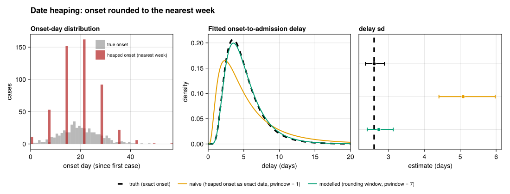

# Date heaping (resolution and rounding)
Sandra Montes (@slmontes)
2026-07-06

## The issue

From Table 1 of the paper:

> **Resolution and rounding.** Respondents often approximate dates
> (e.g. “about a week ago”), causing date heaping.  
> *Impact:* produces artificial spikes in the symptom-onset
> distribution; affects estimates of delay distributions.

Date heaping is digit preference applied to dates: respondents who
cannot recall an exact day round to a memorable reference point, the
start of the week, the 1st or 15th of the month, “last Sunday”. Heaping
of this kind is a well-studied form of measurement error in discrete
data, and reported dates of personal events are one of its classic
domains (Roberts and Brewer 2001). Consequently, recorded dates can
aggregate around these reference points, introducing peaks that are
unrelated to the underlying transmission dynamics.

Heaping is easily overlooked because of how its error propagates.
Rounding an onset to the nearest week is roughly symmetric, so it barely
moves the *location* of the calculated onset-to-admission delay: the
median is close to unbiased. Its effect is on the *dispersion*. Each
delay inherits a rounding error of up to $\pm 3$ days, and if those
rounded dates are treated as if they were exact, that error is absorbed
into the fit as though it were real variability in the delay, inflating
the estimated spread. If one is checking only the mean or median, one
would see nothing wrong while the standard deviation, and any interval
or tail quantity that depends on it, could be overstated. Here we show
that an estimator ignoring the rounding stays roughly unbiased for
location but is badly biased for dispersion.

Heaping is a generator-independent observation process, so in this
analysis it is shown for the DDSA pipeline only.

## Methods

We simulate a clean DDSA line list, then round each true onset to the
nearest whole week (a multiple of 7 days from the epidemic origin). This
simulates digit preference / heaping: the recorded onsets pile up on
weekly marks, generating artificial spikes in the onset-day distribution
every 7 days. The calculated onset-to-admission delay
(`admission − onset`) then inherits a rounding error of up to $\pm 3$
days. While this error does not spike the delay distribution, it can
inflate its apparent dispersion.

We fit the onset-to-admission delay under three assumptions:

- **Truth**: the exact onset date is known
- **Naive**: the heaped onset is treated as an exact date
  (`pwindow = 1`)
- **Modelled**: the heaped onset is treated as the 7-day rounding window
  it represents, interval-censored with `pwindow = 7`

The naive and modelled fits differ in how they handle the rounding
window. By setting `pwindow = 1`, the naive fit assumes the rounded date
is exact, allowing the rounding error to appear as true delay
variability. On the other hand, the modelled fit uses `pwindow = 7` to
treat the heaped date as the 7-day rounding interval it actually
represents. Because the likelihood integrates over all the possible
onset days within that week, the variance is not attributed to the
delay. This relies on the same interval-censoring methods used for the
uncertain-date scenario. Here, the window is the rounding interval
rather than a respondent’s vague recollection. Inference is performed
using `fit_lognormal_pcd`, which fits a lognormal delay via Hamiltonian
Monte Carlo (`Turing.jl`) using a primary-event–censored likelihood from
`CensoredDistributions.jl` (Abbott et al. 2025), the Julia counterpart
of R’s `primarycensored` (Charniga 2024; Abbott et al. 2026).

## Setup

The Quarto Julia engine runs with `--project=@.`, which resolves up to
`analyses/Project.toml` (with `DDSALineLists` developed from
`../DDSALineLists`). On a fresh checkout run `Pkg.instantiate()` once.

``` julia
using Pkg
Pkg.instantiate()

using DDSALineLists
using DataFrames
using Dates
using Distributions
using Random

include(joinpath(@__DIR__, "..", "shared", "fit_helpers.jl"))
include(joinpath(@__DIR__, "..", "shared", "scenario_plots.jl"))

const SEED = 1234
const N_SUB = 500      # realistic surveillance sample size (primary fit cohort)
const HEAP_PERIOD = 7   # round onset to the nearest multiple of this many days
const FIG_DIR = abspath(joinpath(@__DIR__, "..", "..", "figures"))
const OUT_PATH = joinpath(FIG_DIR, "issue_date_heaping.png")
```

## Simulate a clean DDSA line list

``` julia
p = DDSAParams(β = 0.6, γ = 0.4, ρ = 0.005, N = 30_000, nsteps = 200)
ll = simulate_linelist_ddsa(p;
    reporting_delay_dist = Distributions.Gamma(3, 1),
    admi_delay_dist = LogNormal(1.5, 0.5),
    seed = SEED,
)
ll = subsample_linelist(ll, N_SUB; seed = SEED)
println("DDSA line list: $(nrow(ll)) cases")
```

    DDSA line list: 500 cases

## Heap the onsets and build the three delay sets

``` julia
t0 = minimum(ll.date_onset)
half = HEAP_PERIOD ÷ 2

# Per-case quantities.
onset_day = Int[Dates.value(ll.date_onset[i] - t0) for i in axes(ll, 1)]
heaped_day = round.(Int, onset_day ./ HEAP_PERIOD) .* HEAP_PERIOD
adm = ll.date_admission

# Delays under the three analyses.
truth_delays = Float64[]
naive_delays = Float64[]                  # heaped onset treated as exact
cens_delays, cens_pw = Float64[], Float64[]  # heaped onset as a 7-day window
for i in axes(ll, 1)
    a = Dates.value(adm[i] - t0)
    dt = a - onset_day[i]
    dt >= 0 && push!(truth_delays, dt)
    dn = a - heaped_day[i]
    dn >= 0 && push!(naive_delays, dn)
    # True onset lies in [heaped-half, heaped+half]; lower bound → delay, width 7.
    lo = heaped_day[i] - half
    dc = a - lo
    if dc >= 0
        push!(cens_delays, dc)
        push!(cens_pw, Float64(HEAP_PERIOD))
    end
end
```

## Fit the delay distribution under each analysis

``` julia
fit(delays; pwindow = ones(length(delays)), seed) = fit_lognormal_pcd(delays;
    pwindow = pwindow, D = (length(delays) > 0 ? maximum(delays) : 0.0) + 2.0,
    n_samples = 1000, n_chains = 2, seed = seed)

est_truth = fit(truth_delays;                      seed = SEED)
est_naive = fit(naive_delays;                      seed = SEED + 1)
est_cens  = fit(cens_delays; pwindow = cens_pw,    seed = SEED + 2)
```

## Figure

The left panel shows the true-vs-heaped onset-day histograms (the
artificial spikes). The right panels show the fitted delay density and
its standard deviation under the three analyses.

``` julia
fig = Figure(size = (1100, 420), figure_padding = (12, 18, 8, 8))
Label(fig[1, 1:3], "Date heaping: onset rounded to the nearest week";
      fontsize = 17, font = :bold, halign = :left, tellwidth = false)

maxd = maximum(onset_day)
ax1 = Axis(fig[2, 1]; xlabel = "onset day (since first case)", ylabel = "cases",
           title = "Onset-day distribution", titlealign = :left)
hist!(ax1, onset_day; bins = 0:1:maxd, color = (:gray, 0.55), label = "true onset")
hist!(ax1, heaped_day; bins = 0:1:maxd, color = (:firebrick, 0.7),
      label = "heaped onset (nearest week)")
xlims!(ax1, 0, min(maxd, 70))
axislegend(ax1; position = :rt, labelsize = 10, framevisible = false)

truth_dist = LogNormal(est_truth.dist.μ, est_truth.dist.σ)
ax2 = Axis(fig[2, 2]; xlabel = "delay (days)", ylabel = "density",
           title = "Fitted onset-to-admission delay", titlealign = :left)
xs = range(0.01, 20; length = 600)
palette = Makie.wong_colors()
lines!(ax2, xs, pdf.(truth_dist, xs); color = :black, linestyle = :dash, linewidth = 3.5)
lines!(ax2, xs, pdf.(est_naive.dist, xs); color = palette[2], linewidth = 2)
lines!(ax2, xs, pdf.(est_cens.dist, xs);  color = palette[3], linewidth = 2)
xlims!(ax2, 0, 20)

ax3 = Axis(fig[2, 3]; xlabel = "estimate (days)", title = "delay sd", titlealign = :left)
ests = [est_truth, est_naive, est_cens]
cols = [:black, palette[2], palette[3]]
ys = collect(length(ests):-1:1)
vlines!(ax3, [est_truth.sd[1]]; color = :black, linestyle = :dash, linewidth = 3.5)
for (k, e) in enumerate(ests)
    pt, lo, hi = e.sd
    errorbars!(ax3, [pt], [ys[k]], [pt - lo], [hi - pt]; direction = :x,
               color = cols[k], whiskerwidth = 8, linewidth = 2)
    scatter!(ax3, [pt], [ys[k]]; color = cols[k], markersize = 11,
             strokecolor = :white, strokewidth = 1)
end
ylims!(ax3, 0.4, length(ests) + 0.9)
hideydecorations!(ax3; grid = false)

Legend(fig[3, 1:3],
    [LineElement(; color = :black, linestyle = :dash, linewidth = 3.5),
     LineElement(; color = palette[2], linewidth = 2),
     LineElement(; color = palette[3], linewidth = 2)],
    ["truth (exact onset)",
     "naive (heaped onset as exact date, pwindow = 1)",
     "modelled (rounding window, pwindow = 7)"];
    orientation = :horizontal, framevisible = false, labelsize = 11)

rowsize!(fig.layout, 1, Fixed(28))
rowsize!(fig.layout, 3, Fixed(28))
save(OUT_PATH, fig)
fig
```



## Results

The left panel displays the visible symptom of heaping: the true
onset-day distribution is smooth, while the heaped version collapses
onto weekly marks, generating the artificial spikes described in Table 1
of the paper. On its own, this already corrupts any analysis of the
onset curve, growth rate, or peak timing. We can observe these spikes
here only because the simulation provides the true distribution for
comparison; in real data, heaping can be detected by testing whether a
hypothesised set of preferred values (for weekly heaping, the multiples
of 7) is over-represented relative to its neighbouring days (Roberts and
Brewer 2001). That diagnostic would indicate whether the onset field is
heaped, and whether the censoring window applied here is needed.

The right panels demonstrate the subtler consequence for the delay
estimate, confirming the location-versus-dispersion split described in
the introduction. The median moves very little: $\sim4.44$ days on the
exact data, $\sim4.21$ under naive heaping, and $\sim4.53$ under the
censored model. Because these estimates are close together, evaluating
only the central estimate could lead us to conclude, falsely, that
heaping is harmless. The standard deviation, however, reveals the actual
distortion: it sits at approximately 2.61 days on the exact data but
inflates to around 5.07 under naive handling. This near-doubling occurs
because each calculated delay carries a rounding error of up to $\pm 3$
days, which the `pwindow = 1` fit misinterprets as genuine spread.
Treating the heaped date as the 7-day window it represents pulls the
standard deviation back to $\sim2.74$, essentially recovering the
clean-data value. The heaping scenario therefore leaves the median
looking unbiased while badly distorting the dispersion.

In this example, the remedy is to carry the rounding interval through
the fit rather than discard it. Our simulation rounds every onset
independently of its true value, and it is this independence that lets a
fixed 7-day censoring window restore the dispersion. Rounding could
instead be informative, where the probability of recording an exact date
depends on the unobserved true onset (for example, if onsets further in
the past are rounded more aggressively). This mirrors the
observed-versus-unobserved distinction that separates the correctable
and non-correctable cases in the informative-missingness vignette: just
as delay-dependent missingness cannot be reweighted away, informative
heaping cannot be resolved by a fixed window and would require a model
of the rounding mechanism itself. Because the formal detection test
above shows only whether heaping is present, not whether it is random or
informative, any analysis should pair it with a judgement about why the
rounding occurs.

## Estimates

    ┌ Info: truth
    │   n = 500
    │   median = (4.442017797100446, 4.246014028033202, 4.636091205372196)
    └   sd = (2.6014689918029585, 2.356052158960175, 2.8883595025413475)
    ┌ Info: naive (heaped)
    │   n = 491
    │   median = (4.226886993614807, 3.933440724743521, 4.5196045103381834)
    └   sd = (5.079821997304822, 4.406567139100164, 5.97280522393134)
    ┌ Info: modelled (censored)
    │   n = 500
    │   median = (4.536847583598517, 4.262499097293831, 4.804161555491905)
    └   sd = (2.730771255551976, 2.4072037688005232, 3.1313541814503623)

<div id="refs" class="references csl-bib-body hanging-indent"
entry-spacing="0">

<div id="ref-CensoredDistributions_jl" class="csl-entry">

Abbott, Sam, Damon Bayer, Sam Brand, Michael DeWitt, and Joseph
Lemaitre. 2025. “CensoredDistributions.jl.”
<https://doi.org/10.5281/zenodo.18474652>.

</div>

<div id="ref-primarycensored" class="csl-entry">

Abbott, Sam, Sam Brand, James Mba Azam, Carl Pearson, Sebastian Funk,
and Kelly Charniga. 2026. *Primarycensored: Primary Event Censored
Distributions*. <https://doi.org/10.5281/zenodo.13632839>.

</div>

<div id="ref-charniga2024delays" class="csl-entry">

Charniga, Sang Woo AND Akhmetzhanov, Kelly AND Park. 2024. “Best
Practices for Estimating and Reporting Epidemiological Delay
Distributions of Infectious Diseases.” *PLOS Computational Biology* 20
(10): 1–21. <https://doi.org/10.1371/journal.pcbi.1012520>.

</div>

<div id="ref-roberts2001heaping" class="csl-entry">

Roberts, John M., and Devon D. Brewer. 2001. “Measures and Tests of
Heaping in Discrete Quantitative Distributions.” *Journal of Applied
Statistics* 28 (7): 887–96. <https://doi.org/10.1080/02664760120074960>.

</div>

</div>
