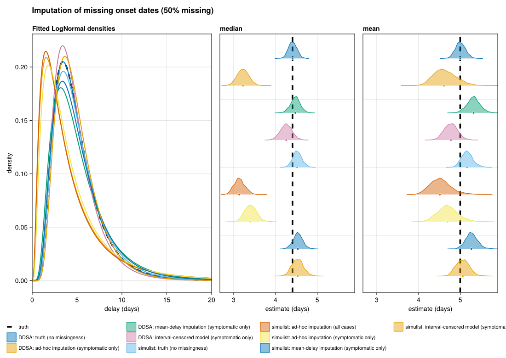

# Imputation of missing onset dates
Sandra Montes (@slmontes)
2026-07-06

## The issue

Symptom-onset dates are among the most frequently missing fields in a
line list, and a common reflex is to fill the gap so every record has a
date, which, handled naively, introduces bias. The usual default,
setting a missing onset equal to the date of report, assumes that the
case was reported the day symptoms began (i.e. an onset-to-report delay
of zero). Thus, every imputed case enters the analysis with an
artificially shortened onset-to-admission interval. This can drag the
fitted delay downward in proportion to how many onsets were imputed.

The bias originates from the mismatch between the imputation rule and
the underlying delay distribution. Here the missingness is completely at
random (MCAR): a uniform 50% of onsets are dropped, so the missingness
carries no information about the delay, and any bias is produced by the
imputation rule rather than by the missing data. This lets us line up
four handling choices, from the naive default to a censoring model that
carries each unknown onset as an interval rather than a point, and read
off the cost of each. All four use the same estimator,
`fit_lognormal_pcd`, which fits a lognormal delay by Hamiltonian Monte
Carlo (`Turing.jl`) under a primary-event–censored likelihood from
`CensoredDistributions.jl` (Abbott et al. 2025), the Julia counterpart
of R’s `primarycensored` (Charniga 2024; Abbott et al. 2026).

Each scenario is evaluated using two independently generated line lists.
The **DDSA** pipeline is a mechanistic Julia model where the outbreak
and its data-quality issue emerge from the data-generating process. The
**`simulist`** pipeline uses a clean line list from the `simulist` R
package, degraded post-hoc via an explicit masking rule (here, 50% of
onset dates are masked). Because these pipelines share no code and were
implemented in different languages, consistent results across both would
suggest that the bias is a property of the imputation process rather
than an artifact of the data generation. One caveat: as both pipelines
draw the onset-to-admission delay from the same lognormal distribution,
their agreement serves as validation of the degradation and inference
methods rather than independently reproducing broader epidemiological
dynamics.

## The four analyses

1.  **Ad-hoc imputation (all cases)**: Naively impute
    `date_onset := date_reporting`, with no asymptomatic filter.
    Asymptomatic cases in the `simulist` baseline have `date_reporting`
    recentered around `date_admission`, so their imputed delay sits
    close to zero.
2.  **Ad-hoc imputation (symptomatic only)**: Same impute, then filter
    `asymptomatic == FALSE`.
3.  **Mean-delay imputation (symptomatic only)**: Impute missing onset
    as `date_reporting − mean_delay`, where `mean_delay` is the mean
    onset-to-reporting gap among observed-onset cases. This treats every
    imputed onset as exact.
4.  **Interval-censored model (symptomatic only)**: No impute.
    Known-onset rows enter the censored likelihood with `pwindow = 1`;
    missing-onset rows enter with
    `earliest_onset = max(min(date_onset across cohort), date_admission − 56)`
    and `latest_onset = max(date_admission, date_reporting)`,
    `pwindow = latest − earliest + 1`.

These four approaches differ in the primary-event window (`pwindow`)
assigned to each missing onset. The first three commit each case to a
single date and fit it with `pwindow = 1`, discarding the uncertainty of
the imputation. Date-of-report imputation introduces a location bias by
forcing the onset-to-report delay to zero. Mean-delay imputation
corrects this location bias by centring the guess on the observed mean
gap. However, because it too commits each case to a single imputed date,
it discards the spread of plausible onsets and need not reproduce the
true dispersion of the delay distribution (examined in the Results). The
interval-censored model avoids inventing a date. Instead it widens
`pwindow` to the admissible interval `[earliest, latest]`, allowing the
likelihood to integrate over all feasible onset days (Charniga 2024).
Under MCAR, this interval is uninformative regarding the location of the
onset but is honest about the uncertainty, so we expect it to recover
the true dispersion below.

The DDSA pipeline uses `simulate_linelist_ddsa_asympt(α = 0.4)`, which
incorporates an asymptomatic compartment. Because DDSA asymptomatics
never reach admission, they do not affect the admission-based delay
distribution, so the “all cases” curve coincides with the “symptomatic
only” curve and is omitted here. The `simulist` pipeline, whose
asymptomatic cases do carry admission dates, additionally shows the “all
cases” ad-hoc curve, where failing to filter asymptomatics pulls the
estimate down.

## Setup

``` julia
using Pkg
Pkg.instantiate()

using DDSALineLists
using DataFrames
using Dates
using Distributions
using Random
using Statistics: mean, median

include(joinpath(@__DIR__, "..", "shared", "fit_helpers.jl"))
include(joinpath(@__DIR__, "..", "shared", "scenario_plots.jl"))
include(joinpath(@__DIR__, "..", "shared", "simulist_loader.jl"))

const SEED = 1234
# Per-pipeline subsample of the full line list, tuned so each pipeline's symptomatic-
# admitted fit cohort lands near ~500 despite very different admission fractions
# (DDSA asympt admits ~60% of cases; `simulist` `hosp_risk=0.2` admits ~16%). We
# subsample the full list — not the admitted subset — because `simulist`'s
# "all cases" curve needs the asymptomatic rows retained in proportion.
const N_SUB_DDSA = 850
const N_SUB_SIM = 3100
const FIG_DIR = abspath(joinpath(@__DIR__, "..", "..", "figures"))
const OUT_PATH = joinpath(FIG_DIR, "issue_imputation.png")
```

## Helpers

``` julia
# Apply 50% Bernoulli missingness to date_onset in place.
function apply_50pct_missingness!(ll::DataFrame; seed::Int)
    rng = MersenneTwister(seed)
    miss_mask = rand(rng, nrow(ll)) .< 0.5
    allowmissing!(ll, :date_onset)
    ll[miss_mask, :date_onset] .= missing
    return ll
end

# Pick the asymptomatic mask. Both pipelines now expose an `asymptomatic`
# Bool column, but DDSA's column may be missing for some rows; treat
# missing as not-asymptomatic.
asymptomatic_mask(ll) = [ismissing(a) ? false : a for a in ll.asymptomatic]

# "Ad-hoc imputation" recipe: impute missing date_onset with date_reporting
# (optionally restrict to symptomatic), then take date_admission − imputed
# onset with pwindow = 1 for every row.
function adhoc_impute_delays(ll::DataFrame; only_symptomatic::Bool)
    asymp = asymptomatic_mask(ll)
    delays = Float64[]
    pwindows = Float64[]
    for i in axes(ll, 1)
        only_symptomatic && asymp[i] && continue
        adm = ll.date_admission[i]
        ismissing(adm) && continue
        on = ll.date_onset[i]
        rep = ll.date_reporting[i]
        if ismissing(on)
            ismissing(rep) && continue
            on = rep
        end
        d = Dates.value(adm - on)
        d >= 0 || continue
        push!(delays, d)
        push!(pwindows, 1.0)
    end
    return delays, pwindows
end

# "Ad-hoc imputation (subtract mean delay)" recipe (do_impute_with_mean_delay):
# estimate the mean onset-to-reporting delay from cases with an observed onset,
# then impute each missing onset as date_reporting − mean_delay (rounded to whole
# days). delay = date_admission − imputed onset, pwindow = 1 for every row. This
# is method (ii) in the paper's Methods: it corrects the zero-delay assumption of
# the plain date-of-report imputation, but because it fixes each imputed onset to a
# point, the filled-in delays carry the admission-to-report spread, so it OVER-
# disperses relative to both the truth and the censoring model.
function mean_delay_impute_delays(ll::DataFrame; only_symptomatic::Bool)
    asymp = asymptomatic_mask(ll)
    # Mean onset-to-reporting delay over observed-onset cases in the cohort.
    gaps = Float64[]
    for i in axes(ll, 1)
        only_symptomatic && asymp[i] && continue
        on = ll.date_onset[i]
        rep = ll.date_reporting[i]
        (ismissing(on) || ismissing(rep)) && continue
        push!(gaps, Float64(Dates.value(rep - on)))
    end
    isempty(gaps) && error("mean_delay_impute_delays: no observed onset+reporting pairs")
    mean_delay = Day(round(Int, mean(gaps)))

    delays = Float64[]
    pwindows = Float64[]
    for i in axes(ll, 1)
        only_symptomatic && asymp[i] && continue
        adm = ll.date_admission[i]
        ismissing(adm) && continue
        on = ll.date_onset[i]
        rep = ll.date_reporting[i]
        if ismissing(on)
            ismissing(rep) && continue
            on = rep - mean_delay
        end
        d = Dates.value(adm - on)
        d >= 0 || continue
        push!(delays, d)
        push!(pwindows, 1.0)
    end
    return delays, pwindows
end

# "Missingness model" recipe: known onsets enter with pwindow = 1; missing
# onsets enter with a wider per-row pwindow spanning [earliest, latest].
function missingness_model_delays(ll::DataFrame; only_symptomatic::Bool = true)
    asymp = asymptomatic_mask(ll)
    keep = [!asymp[i] || !only_symptomatic for i in axes(ll, 1)]
    sub = ll[keep, :]
    obs = collect(skipmissing(sub.date_onset))
    isempty(obs) && error("missingness_model_delays: no observed onsets")
    min_obs_onset = minimum(obs)

    delays = Float64[]
    pwindows = Float64[]
    for i in axes(sub, 1)
        adm = sub.date_admission[i]
        ismissing(adm) && continue
        on = sub.date_onset[i]
        rep = sub.date_reporting[i]
        if !ismissing(on)
            d = Dates.value(adm - on)
            d >= 0 || continue
            push!(delays, d)
            push!(pwindows, 1.0)
        else
            earliest = max(min_obs_onset, adm - Day(56))
            latest = ismissing(rep) ? adm : max(adm, rep)
            d = Dates.value(adm - earliest)
            d >= 0 || continue
            push!(delays, d)
            push!(pwindows, Float64(Dates.value(latest - earliest) + 1))
        end
    end
    return delays, pwindows
end

# Pre-masking truth reference: original date_onset, pwindow = 1, optional
# asymptomatic filter.
function truth_delays(ll::DataFrame; only_symptomatic::Bool = true)
    asymp = asymptomatic_mask(ll)
    delays = Float64[]
    pwindows = Float64[]
    for i in axes(ll, 1)
        only_symptomatic && asymp[i] && continue
        adm = ll.date_admission[i]
        on = ll.date_onset[i]
        (ismissing(adm) || ismissing(on)) && continue
        d = Dates.value(adm - on)
        d >= 0 || continue
        push!(delays, d)
        push!(pwindows, 1.0)
    end
    return delays, pwindows
end

function fit_pair(delays, pwindows; seed)
    fit_lognormal_pcd(delays;
        pwindow = pwindows,
        D = (length(delays) > 0 ? maximum(delays) : 0.0) + 2.0,
        n_samples = 1000, n_chains = 2, seed = seed)
end
```

## DDSA pipeline

`α = 0.4` for parity with the `simulist` baseline’s asymptomatic share
among recovered cases; `q = 1` (asymptomatics are equally infectious).

``` julia
p = DDSAParams(β = 0.6, γ = 0.4, ρ = 0.005, N = 30_000, nsteps = 200, α = 0.4)
ll_ddsa_full = simulate_linelist_ddsa_asympt(p;
    reporting_delay_dist = Distributions.Gamma(3, 1),
    admi_delay_dist = LogNormal(1.5, 0.5),
    seed = SEED,
)
ll_ddsa_full = subsample_linelist(ll_ddsa_full, N_SUB_DDSA; seed = SEED)
println("DDSA: $(nrow(ll_ddsa_full)) cases, $(count(asymptomatic_mask(ll_ddsa_full))) asymptomatic")

# Truth reference: pre-masking, symptomatic-only.
truth_d_d, truth_d_pw = truth_delays(ll_ddsa_full; only_symptomatic = true)
est_truth_d = fit_pair(truth_d_d, truth_d_pw; seed = SEED)

# Apply 50% missingness on top of any pre-existing missing onsets (asymp).
apply_50pct_missingness!(ll_ddsa_full; seed = SEED + 7)

# Two ad-hoc curves (the "with asymptomatic" curve collapses to "only symptomatic"
# on DDSA because DDSA asymptomatics have no admission, so it is omitted).
adhoc_os_d, adhoc_os_pw = adhoc_impute_delays(ll_ddsa_full; only_symptomatic = true)
meandelay_os_d, meandelay_os_pw = mean_delay_impute_delays(ll_ddsa_full; only_symptomatic = true)
missmodel_d, missmodel_pw = missingness_model_delays(ll_ddsa_full; only_symptomatic = true)

est_ddsa_os = fit_pair(adhoc_os_d, adhoc_os_pw; seed = SEED + 1)
est_ddsa_md = fit_pair(meandelay_os_d, meandelay_os_pw; seed = SEED + 3)
est_ddsa_mm = fit_pair(missmodel_d, missmodel_pw; seed = SEED + 2)

estimates = [est_truth_d, est_ddsa_os, est_ddsa_md, est_ddsa_mm]
labels = ["DDSA: truth (no missingness)",
          "DDSA: ad-hoc imputation (symptomatic only)",
          "DDSA: mean-delay imputation (symptomatic only)",
          "DDSA: interval-censored model (symptomatic only)"]
```

## `simulist` pipeline

``` julia
ll_sim_full = load_simulist_baseline(seed = SEED)
if !isnothing(ll_sim_full)
    ll_sim_full = subsample_linelist(ll_sim_full, N_SUB_SIM; seed = SEED)
    sim_truth_d, sim_truth_pw = truth_delays(ll_sim_full; only_symptomatic = true)
    push!(estimates, fit_pair(sim_truth_d, sim_truth_pw; seed = SEED + 10))
    push!(labels, "simulist: truth (no missingness)")

    apply_50pct_missingness!(ll_sim_full; seed = SEED + 7)

    sim_wa_d, sim_wa_pw = adhoc_impute_delays(ll_sim_full; only_symptomatic = false)
    sim_os_d, sim_os_pw = adhoc_impute_delays(ll_sim_full; only_symptomatic = true)
    sim_md_d, sim_md_pw = mean_delay_impute_delays(ll_sim_full; only_symptomatic = true)
    sim_mm_d, sim_mm_pw = missingness_model_delays(ll_sim_full; only_symptomatic = true)

    push!(estimates, fit_pair(sim_wa_d, sim_wa_pw; seed = SEED + 11))
    push!(estimates, fit_pair(sim_os_d, sim_os_pw; seed = SEED + 12))
    push!(estimates, fit_pair(sim_md_d, sim_md_pw; seed = SEED + 14))
    push!(estimates, fit_pair(sim_mm_d, sim_mm_pw; seed = SEED + 13))
    push!(labels, "simulist: ad-hoc imputation (all cases)")
    push!(labels, "simulist: ad-hoc imputation (symptomatic only)")
    push!(labels, "simulist: mean-delay imputation (symptomatic only)")
    push!(labels, "simulist: interval-censored model (symptomatic only)")
else
    @warn "Skipping simulist pipeline — DDSA-only figure"
end
```

## Figure

Truth is the no-missingness fit on undegraded DDSA data, so the
reference isolates the imputation effect from the baseline
discrete-vs-continuous offset. Because the dashed line is anchored to
DDSA, the independent `simulist` no-missingness fit sits close but not
exactly on it.

``` julia
fig = comparison_figure(
    estimates, labels;
    truth = (meanlog = est_truth_d.dist.μ, sdlog = est_truth_d.dist.σ),
    title = "Imputation of missing onset dates (50% missing)",
)
save(OUT_PATH, fig)
fig
```



## Results

The clean-data reference sits near a median delay of 4.4 days. Imputing
missing onsets with the date of report reduces this to about 3.2 days in
DDSA (95% CrI 2.9–3.5) and 3.4 days in `simulist` (3.1–3.7), a downward
location bias of roughly 25%. This agreement across both generators
points to the zero-delay assumption as the driver rather than a quirk of
one pipeline. Both pipelines share one subtlety worth noting. Imputing
onset to the report date places it after admission whenever report
follows admission, and the non-negative-delay filter then drops those
cases, here about 9% (524 down to 475). Because those are the
would-be-negative delays, this silent drop tempers the shortening rather
than causing it. In the `simulist` pipeline, the “all cases” curve
exhibits a further decline to about 3.1 days; this occurs because the
asymptomatic reporting dates are clustered near admission, forcing the
imputed onset-to-admission delay towards zero. This illustrates that the
magnitude of imputation bias is sensitive to the underlying subgroup
structure rather than being a constant parameter. Thus, the
pipeline-independent assessment focuses on the symptomatic-only cases,
where the two generators converge.

Subtracting the mean onset-to-report delay before imputation removes
almost all of the location bias (median $\approx 4.5$ days in both
pipelines), confirming that the initial bias stemmed from where the
guess was placed, not from imputing at all. It does not, however,
recover the clean-data spread of the delay distribution. Because it
fixes each missing onset to `date_reporting − mean_delay`, the imputed
delays inherit the variance of the admission-to-report gap rather than
the true onset-to-admission variance, so the fitted distribution is
over-dispersed rather than too narrow (sd $\approx 3.4$ in DDSA and
$3.1$ in `simulist`, against a clean-data $2.7$–$2.8$). The plain
date-of-report imputation distorts the spread more severely (sd
$\approx 4.5$–$4.8$ days), on top of its location bias. The
interval-censored model is the only approach that recovers both
quantities: it keeps the central estimate close to the clean-data
reference (median about 4.3 days in DDSA, 4.5 in `simulist`) and returns
the spread to near its clean-data value (sd $\approx 2.4$–$2.5$ days
against a clean-data $2.7$–$2.8$, and $2.61$ against $2.69$ across the
DDSA replications). That is exactly the right behaviour under MCAR: the
missingness biases neither the location nor the spread, so both are
recovered, while the per-record onset uncertainty is carried through the
widened `pwindow` rather than being discarded by committing to a single
imputed date. When missingness is instead informative, imputation and
censoring behave very differently (see issue_informative_missingness).

## Estimates

    ┌ Info: DDSA: truth (no missingness)
    │   n = 524
    │   median = (4.408675145257325, 4.220879470410645, 4.604937035699469)
    │   mean = (4.997540470924753, 4.771852434490175, 5.247812734493856)
    └   sd = (2.6687252116020357, 2.4225162012306027, 2.966031582608305)
    ┌ Info: DDSA: ad-hoc imputation (symptomatic only)
    │   n = 475
    │   median = (3.2232387400470124, 2.9591458244258306, 3.5115748992682962)
    │   mean = (4.613007252665209, 4.179713397142631, 5.259546746729506)
    └   sd = (4.757760227750992, 3.8809240504122133, 6.10966703076422)
    ┌ Info: DDSA: mean-delay imputation (symptomatic only)
    │   n = 515
    │   median = (4.477136302079639, 4.237350844308724, 4.707656268634606)
    │   mean = (5.3178420456908615, 5.01220103565084, 5.624360294383004)
    └   sd = (3.3964865763077157, 3.0281226834061092, 3.8516227818995965)
    ┌ Info: DDSA: interval-censored model (symptomatic only)
    │   n = 524
    │   median = (4.2570209267126415, 3.988675542384436, 4.532196674285864)
    │   mean = (4.775236924791424, 4.475293255382006, 5.09783641160129)
    └   sd = (2.4114530652497765, 2.1025923161163327, 2.809356115136213)
    ┌ Info: simulist: truth (no missingness)
    │   n = 507
    │   median = (4.518957525545607, 4.320526822823997, 4.743914461939672)
    │   mean = (5.161145345106616, 4.9189932738718465, 5.4534782985991335)
    └   sd = (2.837292361020626, 2.552627807157617, 3.2003222096823247)
    ┌ Info: simulist: ad-hoc imputation (all cases)
    │   n = 537
    │   median = (3.1354015921320757, 2.9029944183835372, 3.401129641369525)
    │   mean = (4.5115266214541965, 4.092710986545448, 5.087390667109827)
    └   sd = (4.660624097992626, 3.8643825251691744, 5.910783875004)
    ┌ Info: simulist: ad-hoc imputation (symptomatic only)
    │   n = 462
    │   median = (3.400883182894086, 3.139226800102824, 3.6791347345637444)
    │   mean = (4.693886123929451, 4.265183325087486, 5.209078711579316)
    └   sd = (4.45407931205173, 3.701466147444671, 5.4833747535721695)
    ┌ Info: simulist: mean-delay imputation (symptomatic only)
    │   n = 504
    │   median = (4.534557491507059, 4.31077798351937, 4.771966341021803)
    │   mean = (5.265166062262784, 4.998782543428824, 5.570027008803576)
    └   sd = (3.101665699384485, 2.7992694202103725, 3.5174713567270652)
    ┌ Info: simulist: interval-censored model (symptomatic only)
    │   n = 507
    │   median = (4.530050367997571, 4.267192916021772, 4.814050833120142)
    │   mean = (5.057353065597299, 4.771507678282937, 5.366529014917254)
    └   sd = (2.5005343559714994, 2.209814880856166, 2.8784892771513375)

<div id="refs" class="references csl-bib-body hanging-indent"
entry-spacing="0">

<div id="ref-CensoredDistributions_jl" class="csl-entry">

Abbott, Sam, Damon Bayer, Sam Brand, Michael DeWitt, and Joseph
Lemaitre. 2025. “CensoredDistributions.jl.”
<https://doi.org/10.5281/zenodo.18474652>.

</div>

<div id="ref-primarycensored" class="csl-entry">

Abbott, Sam, Sam Brand, James Mba Azam, Carl Pearson, Sebastian Funk,
and Kelly Charniga. 2026. *Primarycensored: Primary Event Censored
Distributions*. <https://doi.org/10.5281/zenodo.13632839>.

</div>

<div id="ref-charniga2024delays" class="csl-entry">

Charniga, Sang Woo AND Akhmetzhanov, Kelly AND Park. 2024. “Best
Practices for Estimating and Reporting Epidemiological Delay
Distributions of Infectious Diseases.” *PLOS Computational Biology* 20
(10): 1–21. <https://doi.org/10.1371/journal.pcbi.1012520>.

</div>

</div>
