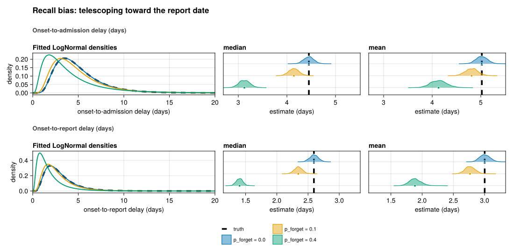
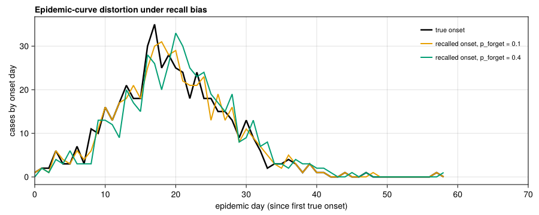
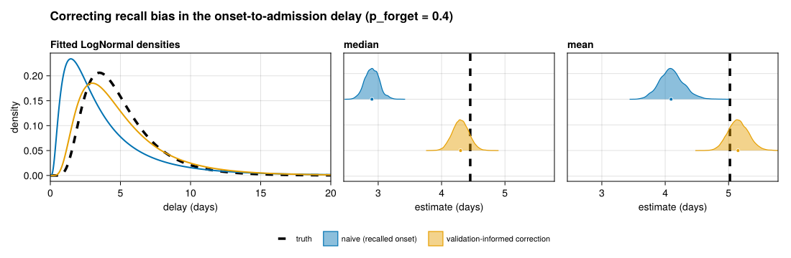

# Recall bias (telescoping toward the report date)
Sandra Montes (@slmontes)
2026-07-06

## The issue

Recall bias occurs when symptom onset dates are derived from patient
self-reporting rather than extracted from clinical records. Because
individuals recall recent events more accurately than distant ones, they
tend to anchor vague dates to more recent markers (“I think it started
last weekend”), so a remembered onset drifts toward the present. The
magnitude of this drift increases with the true time elapsed since
symptom onset. A patient interviewed one day after onset is unlikely to
misremember, whereas a patient interviewed two weeks later may telescope
the reported date forward by several days. This shortens the apparent
interval between onset and subsequent events, and biases delay estimates
downward. This effect can be more pronounced in interview-based
surveillance and retrospective outbreak investigations, where onset
dates are reconstructed days or weeks after the fact.

Here, the telescoping effect is modelled as a cumulative function of a
per-day forgetting probability, p_forget, to evaluate its impact on two
specific intervals: onset-to-admission (the primary estimand of this
study) and onset-to-report. Inference is conducted using
`fit_lognormal_pcd`, which performs a lognormal delay fit via
Hamiltonian Monte Carlo in `Turing.jl`. This approach relies on a
primary-event censored likelihood from `CensoredDistributions.jl`
(Abbott et al. 2025), the Julia equivalent of the R package
`primarycensored` (Charniga 2024; Abbott et al. 2026).

This example is shown for the DDSA pipeline only.

## Methods

A baseline DDSA line list is simulated, followed by the application of
the `add_recall_bias!` function using three distinct forgetting
probabilities (0, 0.1, and 0.4). Each day within the interval between
true onset and reporting is independently dropped with probability
`p_forget`. This mechanism shifts the recalled onset toward the report
date, generating the telescoping effect described previously. Because
each of the $g$ days in the true onset-to-report gap is omitted
independently, the expected magnitude of the recall shift is
$p_{\text{forget}} \cdot g$. This scaling means that longer delays
telescope more than shorter ones, and the compression is not uniform
across cases. This is the same reason the effect grows with the length
of the reporting delay.

We show both onset-to-admission and onset-to-report delays, since recall
bias can affect both. It can shorten the apparent onset-to-report delay
by exactly the recall shift, and shortens the apparent
onset-to-admission delay by the same amount (admission is anchored to
the true clinical event, not to the remembered onset). The recalled
onset is bounded above by the admission date, since a patient cannot
report symptom onset as beginning after their own hospital admission. In
the small share of cases where telescoping would otherwise carry the
recalled onset past admission, it is set equal to the admission date, so
the onset-to-admission delay compresses toward zero rather than turning
negative and being dropped from the fit.

## Setup

``` julia
using Pkg
Pkg.instantiate()

using DDSALineLists
using DataFrames
using Dates
using Distributions
using Random

include(joinpath(@__DIR__, "..", "shared", "fit_helpers.jl"))
include(joinpath(@__DIR__, "..", "shared", "scenario_plots.jl"))

const SEED = 1234
const N_SUB = 500      # realistic surveillance sample size (primary fit cohort)
const FIG_DIR = abspath(joinpath(@__DIR__, "..", "..", "figures"))
const OUT_PATH = joinpath(FIG_DIR, "issue_recall_bias.png")
const OUT_PATH_EPI = joinpath(FIG_DIR, "issue_recall_bias_epicurve.png")
const P_FORGET_LEVELS = [0.0, 0.1, 0.4]

function delays_using(ll::DataFrame, onset_col::Symbol, target_col::Symbol)
    on = ll[!, onset_col]
    tgt = ll[!, target_col]
    Int[Dates.value(tgt[i] - on[i]) for i in axes(ll, 1)
        if !ismissing(on[i]) && !ismissing(tgt[i])]
end
```

## Simulate a clean DDSA line list

``` julia
p = DDSAParams(β = 0.6, γ = 0.4, ρ = 0.005, N = 30_000, nsteps = 200)
ll_clean = simulate_linelist_ddsa(
    p;
    reporting_delay_dist = Distributions.Gamma(3, 1),
    admi_delay_dist = LogNormal(1.5, 0.5),
    seed = SEED,
)
ll_clean = subsample_linelist(ll_clean, N_SUB; seed = SEED)
println("DDSA clean line list: $(nrow(ll_clean)) cases")
```

    DDSA clean line list: 500 cases

## Apply recall bias at each forgetting level and fit

``` julia
est_admission = NamedTuple[]
est_report = NamedTuple[]
labels = String[]
recalled_onsets = Dict{Float64, Vector{Any}}()  # for the epidemic-curve panel
for (k, pf) in enumerate(P_FORGET_LEVELS)
    ll = copy(ll_clean)
    add_recall_bias!(ll; p_forget = pf, seed = SEED + 100 + k)
    # A patient cannot recall symptom onset as occurring after their own
    # admission, so the recalled onset is bounded by the admission date. Because
    # reporting and admission are drawn independently from onset here, reporting
    # sometimes falls after admission, and telescoping toward the report date
    # can otherwise push the recalled onset past admission, producing negative
    # onset-to-admission delays that the fit silently discards.
    ll.date_onset_recalled = [
        ismissing(ll.date_onset_recalled[i]) || ismissing(ll.date_admission[i]) ?
            ll.date_onset_recalled[i] :
            min(ll.date_onset_recalled[i], ll.date_admission[i])
        for i in axes(ll, 1)]
    recalled_onsets[pf] = collect(ll.date_onset_recalled)
    push!(est_admission,
          fit_lognormal_pcd(delays_using(ll, :date_onset_recalled, :date_admission);
                              n_samples = 1000, n_chains = 2, seed = SEED + k))
    push!(est_report,
          fit_lognormal_pcd(delays_using(ll, :date_onset_recalled, :date_reporting);
                              n_samples = 1000, n_chains = 2, seed = SEED + k))
    push!(labels, "p_forget = $pf")
end
```

Truth is the no-recall (`p_forget = 0`) fit, produced by the same
`fit_lognormal_pcd` estimator as every other scenario. Defining “truth”
as the no-recall estimate (rather than the analytic data-generating
distribution) isolates the recall effect. Under this framework, the
`p_forget = 0` scenario aligns with the dashed line, and any deviation
in the other scenarios represents the effect of recall bias.

``` julia
const TRUTH_ADMISSION = (meanlog = est_admission[1].dist.μ,
                         sdlog = est_admission[1].dist.σ)
const TRUTH_REPORT = (meanlog = est_report[1].dist.μ,
                      sdlog = est_report[1].dist.σ)
```

## Figure: delay distributions

``` julia
fig = comparison_figure_two_outcomes(
    est_admission, est_report, labels;
    truth_a = TRUTH_ADMISSION,
    truth_b = TRUTH_REPORT,
    title = "Recall bias: telescoping toward the report date",
    outcome_titles = ("Onset-to-admission delay (days)",
                      "Onset-to-report delay (days)"),
    density_xlabels = ("onset-to-admission delay (days)",
                       "onset-to-report delay (days)"),
)
save(OUT_PATH, fig)
fig
```



## Figure: epidemic-curve distortion

``` julia
function daily_counts(dates, t0::Date, maxday::Int)
    c = zeros(Int, maxday + 1)
    for d in dates
        ismissing(d) && continue
        day = Dates.value(d - t0)
        0 <= day <= maxday && (c[day + 1] += 1)
    end
    return c
end

t0 = minimum(ll_clean.date_onset)
true_days = Int[Dates.value(d - t0) for d in ll_clean.date_onset]
recalled_days = vcat((Int[Dates.value(d - t0) for d in recalled_onsets[pf] if !ismissing(d)]
                      for pf in P_FORGET_LEVELS)...)
maxday = maximum(vcat(true_days, recalled_days))

true_c = daily_counts(ll_clean.date_onset, t0, maxday)
xhi = findlast(>(0), true_c) + 12

fig_epi = Figure(size = (900, 360), figure_padding = (12, 18, 8, 8))
ax = Axis(fig_epi[1, 1];
    xlabel = "epidemic day (since first true onset)",
    ylabel = "cases by onset day",
    title = "Epidemic-curve distortion under recall bias",
    titlealign = :left)
lines!(ax, 0:maxday, true_c; color = :black, linewidth = 2.5, label = "true onset")
palette = Makie.wong_colors()
for (k, pf) in enumerate(P_FORGET_LEVELS)
    pf == 0.0 && continue
    c = daily_counts(recalled_onsets[pf], t0, maxday)
    lines!(ax, 0:maxday, c; color = palette[k], linewidth = 2,
           label = "recalled onset, p_forget = $pf")
end
xlims!(ax, 0, xhi)
axislegend(ax; position = :rt, framevisible = false, labelsize = 11)
save(OUT_PATH_EPI, fig_epi)
fig_epi
```




    --- Onset-to-admission ---
    ┌ Info: p_forget = 0.0
    │   n = 500
    │   median = (4.452245169531041, 4.24919261287088, 4.656405456011626)
    │   mean = (5.0178800436933955, 4.796498652570649, 5.246954981539215)
    └   sd = (2.6153090876290532, 2.3777750704127456, 2.881952723175394)
    ┌ Info: p_forget = 0.1
    │   n = 500
    │   median = (4.121168335169125, 3.931019318508567, 4.334403411960095)
    │   mean = (4.798825725233245, 4.566713035380428, 5.068365142885343)
    └   sd = (2.8576006278998047, 2.5752694389895656, 3.2211210697902275)
    ┌ Info: p_forget = 0.4
    │   n = 500
    │   median = (2.901353663946035, 2.6854330561901936, 3.1381780625266846)
    │   mean = (4.092913640490721, 3.7490534313457657, 4.498350388598079)
    └   sd = (4.065140279375003, 3.482493077777583, 4.8837918119903225)

    --- Onset-to-report ---
    ┌ Info: p_forget = 0.0
    │   n = 500
    │   median = (2.5943579052296517, 2.467163160782835, 2.7269930520949215)
    │   mean = (3.0014242883242996, 2.857202188792413, 3.1671391895580245)
    └   sd = (1.7475161352602944, 1.565235222723354, 1.9672506259541285)
    ┌ Info: p_forget = 0.1
    │   n = 500
    │   median = (2.3465729848677626, 2.2261493710528257, 2.4806387023694216)
    │   mean = (2.7715935332681965, 2.6242807142468116, 2.9499415450542092)
    └   sd = (1.7365180345390914, 1.5329875253027339, 1.9936581388308792)
    ┌ Info: p_forget = 0.4
    │   n = 500
    │   median = (1.41977323216274, 1.314121466112598, 1.537483681137449)
    │   mean = (1.896094930257584, 1.744145028380404, 2.0970064734597766)
    └   sd = (1.685536231815766, 1.409674820116341, 2.0881081185079995)

## Results

Relative to the `p_forget = 0` reference, increasing the forgetting
probability shortens both delay distributions. The onset-to-admission
median decreases from approximately 4.45 days to 4.12 days at
`p_forget = 0.1` and to 2.90 days at `p_forget = 0.4`, representing a
downward bias of roughly 35% at the highest evaluated rate. Over the
same range, the onset-to-report median decreases from approximately 2.59
to 1.42 days.

In relative terms, the onset-to-report delay is more compressed than the
onset-to-admission delay (roughly 45% compared to 35%) because its
baseline duration is shorter, so the same telescoping shift is a larger
fraction of it. Because telescoping occurs only within the interval
between actual onset and reporting, the observed distortion remains
modest under the short reporting delay simulated here, which has a mean
gap of approximately 3 days. This distortion would be expected to scale
with longer reporting gaps.

Additionally, serial interval estimates, which depend directly on onset
timing, would be subject to a similar bias. However, this effect is not
quantified here because the simulated line list records individual cases
rather than linked transmission pairs between an infector and an
infectee.

This telescoping phenomenon also distorts the reconstructed epidemic
curve. As recalled onsets shift closer to the report date, the overall
onset distribution shifts later and flattens. Specifically, the apparent
growth phase is dampened, the decline phase is broadened, and at
`p_forget = 0.4`, the mean onset day shifts later by approximately one
day. This structural shift is consequential because epidemic curves
derived from recalled onsets are used to estimate growth rates and
$R_t$. Therefore, estimation models might interpret the slower,
later-peaking curve as a less transmissible outbreak. Similar to the
effect on delay distributions, this distortion is constrained by the
short reporting delay simulated here but would amplify as the true
onset-to-report gap increases.

## Correcting recall bias

Recall bias differs from the other issues in this guide because the
onset date is present but systematically wrong rather than missing, so
the true delay distribution cannot be recovered from the degraded line
list on its own. A short recalled delay is equally consistent with a
genuinely short delay and with a longer delay that was telescoped, and
these two explanations cannot be separated using the recalled column
alone. A correction therefore needs information from outside that
column. We demonstrate this at `p_forget = 0.4`, where the bias is
largest, using a validation subsample of cases whose true onset is
known.

The validation subsample is a set of cases for which a record-confirmed
onset has been recovered from clinical records alongside the remembered
onset. This assumes the clinical record reproduces the true onset
exactly; real records carry their own transcription and recall error, so
the correction demonstrated here is a best-case bound rather than a
guaranteed recovery. On this subsample the recall shift is observed
directly, and its distribution is used to impute the shift for the
remaining cases. The imputation is repeated so the spread of plausible
shifts is carried through rather than collapsed onto a single guess. We
tried to sharpen the imputation by predicting each shift from the
observed recalled onset-to-report gap, but that gap carries almost no
per-case information, because the gap and the shift are confounded, so
the correction reduces to imputing from the shift distribution learned
on the subsample.

``` julia
const PF_FIX = 0.4
const VAL_FRAC = 0.30      # share of cases with a record-confirmed onset (assumed exact here)
const N_IMP = 15           # multiple-imputation draws for the validation correction
const OUT_PATH_FIX = joinpath(FIG_DIR, "issue_recall_bias_fix.png")

ll_fix = copy(ll_clean)
add_recall_bias!(ll_fix; p_forget = PF_FIX, seed = SEED + 100 + 3)
ll_fix.date_onset_recalled = [
    ismissing(ll_fix.date_onset_recalled[i]) || ismissing(ll_fix.date_admission[i]) ?
        ll_fix.date_onset_recalled[i] :
        min(ll_fix.date_onset_recalled[i], ll_fix.date_admission[i])
    for i in axes(ll_fix, 1)]

nfix = nrow(ll_fix)
recalled_delay = Int[Dates.value(ll_fix.date_admission[i]     - ll_fix.date_onset_recalled[i]) for i in 1:nfix]
true_delay     = Int[Dates.value(ll_fix.date_admission[i]     - ll_fix.date_onset[i])          for i in 1:nfix]
recall_shift   = Int[Dates.value(ll_fix.date_onset_recalled[i] - ll_fix.date_onset[i])         for i in 1:nfix]

# Pool several posterior fits (one per imputation) into one estimate NamedTuple.
function pool_fits(fits)
    med = reduce(vcat, f.median_samples for f in fits)
    mn  = reduce(vcat, f.mean_samples   for f in fits)
    sdv = reduce(vcat, f.sd_samples     for f in fits)
    μs = log.(med)
    σs = sqrt.(max.(2 .* (log.(mn) .- μs), 0.0))
    d  = LogNormal(median(μs), median(σs))
    q(x) = (median(x), quantile(x, 0.025), quantile(x, 0.975))
    return (n = fits[1].n, dist = d, median = q(med), mean = q(mn), sd = q(sdv),
            median_samples = med, mean_samples = mn, sd_samples = sdv)
end

# Validation-informed correction: learn the recall-shift distribution on the
# record-confirmed subsample and multiply-impute it for the remaining cases.
rng_val = MersenneTwister(SEED + 777)
val_mask = falses(nfix)
val_mask[sample(rng_val, 1:nfix, round(Int, VAL_FRAC * nfix); replace = false)] .= true
val_shifts = recall_shift[val_mask]                    # shifts observed where truth is known

rng_imp = MersenneTwister(SEED + 888)
imp_fits = NamedTuple[]
for m in 1:N_IMP
    d = Int[val_mask[i] ? true_delay[i] :
            recalled_delay[i] + sample(rng_imp, val_shifts) for i in 1:nfix]
    push!(imp_fits, fit_lognormal_pcd(filter(≥(0), d); n_samples = 1000, n_chains = 2, seed = SEED + 2000 + m))
end
est_validation = pool_fits(imp_fits)
```

    ┌ Info: validation recall shift (days)
    │   mean = 1.21
    └   n_validation = 150
    ┌ Info: onset-to-admission median (days)
    │   truth = 4.45
    │   naive = 2.9
    └   validation = 4.3
    ┌ Info: onset-to-admission sd (days)
    │   truth = 2.62
    │   naive = 4.07
    └   validation = 3.39

``` julia
fix_estimates = [est_admission[3], est_validation]
fix_labels = ["naive (recalled onset)",
              "validation-informed correction"]
fig_fix = comparison_figure(fix_estimates, fix_labels;
    truth = TRUTH_ADMISSION,
    title = "Correcting recall bias in the onset-to-admission delay (p_forget = 0.4)")
save(OUT_PATH_FIX, fig_fix)
fig_fix
```



With a validation subsample covering 30% of cases, 150 records here, the
recall shift averages about 1.2 days. Imputing that shift for the
remaining cases returns the onset-to-admission median to about 4.3 days,
close to the dashed reference of 4.45 days and well away from the naive
estimate of 2.90 days. The location is recovered, but the dispersion
only partly so. The fitted standard deviation falls from 4.07 days under
the naive fit to 3.39 days, still above the clean-data value of 2.62
days, because the shift is imputed from its marginal distribution and
cannot be matched to each case’s own delay. Fully recovering the spread
would need a per-case predictor of the shift, which the recalled data do
not provide.

When no validation data exist, there is no comparable way to recover the
estimate. The recall shift cannot be measured, and any adjustment would
rest on an assumed telescoping magnitude that the recalled data can
neither confirm nor refute, so the result would reflect the assumption
rather than correct the bias. For recall bias specifically, the
dependable options are therefore obtaining record-confirmed onsets for a
subsample, as above (assuming those records are themselves accurate), or
capturing a less recall-prone onset marker at the point of data
collection. Where neither is possible, the bias must be noted, together
with its likely downward direction, but may not be removable.

<div id="refs" class="references csl-bib-body hanging-indent">

<div id="ref-CensoredDistributions_jl" class="csl-entry">

Abbott, Sam, Damon Bayer, Sam Brand, Michael DeWitt, and Joseph
Lemaitre. 2025. *CensoredDistributions.jl*. Released.
<https://doi.org/10.5281/zenodo.18474652>.

</div>

<div id="ref-primarycensored" class="csl-entry">

Abbott, Sam, Sam Brand, James Mba Azam, Carl Pearson, Sebastian Funk,
and Kelly Charniga. 2026. *Primarycensored: Primary Event Censored
Distributions*. <https://doi.org/10.5281/zenodo.13632839>.

</div>

<div id="ref-charniga2024delays" class="csl-entry">

Charniga, Sang Woo AND Akhmetzhanov, Kelly AND Park. 2024. “Best
Practices for Estimating and Reporting Epidemiological Delay
Distributions of Infectious Diseases.” *PLOS Computational Biology* 20
(10): 1–21. <https://doi.org/10.1371/journal.pcbi.1012520>.

</div>

</div>
