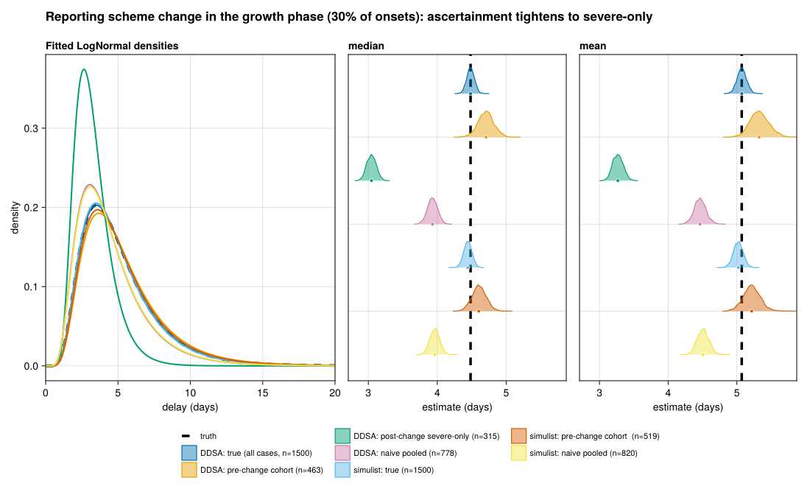

# Reporting-scheme change mid-outbreak
Sandra Montes (@slmontes)
2026-07-06

## The issue

Changing case definitions or reporting criteria, such as restricting
data to hospitalised cases only, introduces structural bias. These
shifts disrupt temporal continuity and complicate statistical
comparisons across different phases of an epidemic.

This pattern frequently emerges during outbreaks. In the early stages,
when case volumes are low, surveillance systems typically capture a
broad spectrum of clinical presentations, including suspected, mild, and
severe cases. As testing and reporting capacities are exceeded,
inclusion criteria often narrow, limiting data to hospitalised or
laboratory-confirmed cases, a phenomenon documented during the COVID-19
and Ebola epidemics. Consequently, the resulting line list aggregates
data from two distinct sampling regimes: a comprehensive early cohort
and a restricted later cohort that skews toward more severe illness.

Because disease severity generally correlates with a shorter time to
admission, the later cohort is enriched with cases exhibiting brief
onset-to-admission delays. As a result, a delay distribution estimated
over the entire outbreak skews toward rapidly presenting cases, even in
the absence of any actual shift in underlying biological dynamics. This
temporal selection bias demonstrates why naive data pooling across the
transition point can yield misleading estimates and complicate
comparisons between epidemic phases.

## Methods

Here we simulate a full epidemic, and then construct an “observed” line
list by combining:

- **Pre-change cases:** all cases whose onset falls before the
  change-point are included
- **Post-change cases:** cases whose onset falls after the change-point
  are ascertained only if they meet the criteria for severe illness.
  Severity functions as a latent per-case proxy rather than representing
  the measured delay itself. The probability is defined as
  $P(\text{severe}) = \text{logistic}(\texttt{SEV\_INTERCEPT} - \texttt{SEV\_SLOPE} \cdot \text{delay})$.
  Consequently, individuals with more severe illness, who typically
  present to care more rapidly and therefore exhibit shorter
  onset-to-admission delays, have a higher probability of retention.
  Importantly, this relationship remains probabilistic and does not
  impose a deterministic cutoff on the estimated delay.

The scheme change is not tied to an arbitrary calendar day but fires
once a fixed fraction of onsets (`CHANGE_FRAC`, 30% by default) has
occurred, placing it in the growth phase before the peak, when reporting
criteria realistically tighten as the surveillance system is
overwhelmed. This fraction is computed separately for each pipeline from
its own onset distribution, so the DDSA and `simulist` branches split at
the same epidemic stage despite their different timescales.

We fit and compare four analyses in each pipeline:

1.  **True:** all cases, with no change applied (the target).
2.  **Pre-change cohort:** restricting the analysis to the single
    reporting-consistent period before the change, which recovers the
    unbiased delay.
3.  **Post-change severe-only:** isolates the structurally biased and
    restricted group.
4.  **Naive pooled:** combines data across the transition point without
    adjustment, illustrating the uncorrected estimation bias.

Inference throughout uses `fit_lognormal_pcd`, a lognormal delay fit by
Hamiltonian Monte Carlo (`Turing.jl`) under a primary-event–censored
likelihood from `CensoredDistributions.jl` (Abbott et al. 2025), the
Julia counterpart of R’s `primarycensored` (Charniga 2024; Abbott et al.
2026). The two independently built pipelines (DDSA in Julia, `simulist`
in R), split at the same epidemic phase, are a cross-check that the bias
is selection-driven rather than an artifact of one generator, with the
usual caveat that both share the underlying delay law.

## Setup

``` julia
using Pkg
Pkg.instantiate()

using DDSALineLists
using DataFrames
using Dates
using Distributions
using Random

include(joinpath(@__DIR__, "..", "shared", "fit_helpers.jl"))
include(joinpath(@__DIR__, "..", "shared", "scenario_plots.jl"))
include(joinpath(@__DIR__, "..", "shared", "simulist_loader.jl"))

const SEED = 1234
const CHANGE_FRAC = 0.3           # change-point at the epidemic PHASE where this
                                  # fraction of onsets has occurred: the growth phase
                                  # before the peak, when reporting criteria
                                  # realistically tighten as the system is overwhelmed.
                                  # Computed per pipeline, not an absolute day, so
                                  # the two epidemics split at the same stage.
const SEV_INTERCEPT = 2.2         # severity-proxy logit intercept; retention drops to
                                  # P(severe)=0.5 at delay = SEV_INTERCEPT/SEV_SLOPE ≈ 3.1 days
const SEV_SLOPE = 0.7             # P(severe) falls steeply as onset-to-admission delay grows
const N_SUB = 1500                # scaled up so pre/post + severity cells stay ≥~200
const FIG_DIR = abspath(joinpath(@__DIR__, "..", "..", "figures"))
const OUT_PATH = joinpath(FIG_DIR, "issue_reporting_scheme_change.png")

function delays_admission(ll::AbstractDataFrame)
    Int[Dates.value(ll.date_admission[i] - ll.date_onset[i]) for i in axes(ll, 1)
        if !ismissing(ll.date_onset[i]) && !ismissing(ll.date_admission[i])]
end

# Epidemic day by which `frac` of onsets have occurred — the phase-indexed
# change-point. Returns days since `t0`, so it adapts to each pipeline's own
# epidemic timescale.
function change_point_day(ll::AbstractDataFrame, t0::Date, frac::Float64)
    days = sort(Int[Dates.value(o - t0) for o in ll.date_onset if !ismissing(o)])
    idx = clamp(ceil(Int, frac * length(days)), 1, length(days))
    return days[idx]
end

"""
Apply the scheme-change observation rule to a line list. Post-change cases are
ascertained according to a probabilistic severity proxy (severe cases present
sooner, so severity correlates with — but does not equal — the onset-to-admission
delay). Returns a NamedTuple of cohorts and counts.
"""
function apply_scheme_change(ll::AbstractDataFrame, t0::Date, t_change_days::Int;
                              sev_intercept::Float64, sev_slope::Float64, seed::Int)
    rng = MersenneTwister(seed)
    days_since = Int[Dates.value(ll.date_onset[i] - t0) for i in axes(ll, 1)]
    onset_to_admi = Int[Dates.value(ll.date_admission[i] - ll.date_onset[i])
                        for i in axes(ll, 1)]
    pre_mask = days_since .≤ t_change_days
    post_mask = .!pre_mask
    # Latent severity: more likely for shorter delays, but probabilistic.
    p_severe = @. 1.0 / (1.0 + exp(-(sev_intercept - sev_slope * onset_to_admi)))
    severe_mask = [rand(rng) < p_severe[i] for i in axes(ll, 1)]
    post_kept = post_mask .& severe_mask

    pre = ll[pre_mask, :]
    post_severe = ll[post_kept, :]
    pooled = ll[pre_mask .| post_kept, :]
    return (pre = pre, post_severe = post_severe, pooled = pooled,
            n_pre = sum(pre_mask), n_post_total = sum(post_mask),
            n_post_kept = sum(post_kept))
end
```

## DDSA pipeline

``` julia
p = DDSAParams(β = 0.6, γ = 0.4, ρ = 0.005, N = 30_000, nsteps = 200)
ll_ddsa = simulate_linelist_ddsa(
    p;
    reporting_delay_dist = Distributions.Gamma(3, 1),
    admi_delay_dist = LogNormal(1.5, 0.5),
    seed = SEED,
)
ll_ddsa = subsample_linelist(ll_ddsa, N_SUB; seed = SEED)
ddsa_change = change_point_day(ll_ddsa, p.t0, CHANGE_FRAC)
ddsa_split = apply_scheme_change(ll_ddsa, p.t0, ddsa_change;
    sev_intercept = SEV_INTERCEPT, sev_slope = SEV_SLOPE, seed = SEED + 50)
println("DDSA: change at day $ddsa_change ($(round(Int, 100CHANGE_FRAC))% of onsets); " *
        "pre-change=$(ddsa_split.n_pre), post-change=$(ddsa_split.n_post_total) " *
        "(of which $(ddsa_split.n_post_kept) kept after severity filter)")
```

    DDSA: change at day 15 (30% of onsets); pre-change=463, post-change=1037 (of which 315 kept after severity filter)

``` julia
estimates = NamedTuple[]
labels = String[]

est_true = fit_lognormal_pcd(
    delays_admission(ll_ddsa);
    n_samples = 1000, n_chains = 2, seed = SEED,
)
push!(estimates, est_true)
push!(labels, "DDSA: true (all cases, n=$(nrow(ll_ddsa)))")

push!(estimates, fit_lognormal_pcd(
    delays_admission(ddsa_split.pre);
    n_samples = 1000, n_chains = 2, seed = SEED + 1,
))
push!(labels, "DDSA: pre-change cohort (n=$(nrow(ddsa_split.pre)))")

push!(estimates, fit_lognormal_pcd(
    delays_admission(ddsa_split.post_severe);
    n_samples = 1000, n_chains = 2, seed = SEED + 2,
))
push!(labels, "DDSA: post-change severe-only (n=$(nrow(ddsa_split.post_severe)))")

push!(estimates, fit_lognormal_pcd(
    delays_admission(ddsa_split.pooled);
    n_samples = 1000, n_chains = 2, seed = SEED + 3,
))
push!(labels, "DDSA: naive pooled (n=$(nrow(ddsa_split.pooled)))")
```

## simulist pipeline

``` julia
ll_sim = load_simulist_baseline(seed = SEED)
if !isnothing(ll_sim)
    sim = ll_sim[.!ismissing.(ll_sim.date_admission) .&
                 .!ismissing.(ll_sim.date_onset), :]
    sim = subsample_linelist(sim, N_SUB; seed = SEED)
    t0_sim = minimum(sim.date_onset)
    sim_change = change_point_day(sim, t0_sim, CHANGE_FRAC)
    sim_split = apply_scheme_change(sim, t0_sim, sim_change;
        sev_intercept = SEV_INTERCEPT, sev_slope = SEV_SLOPE, seed = SEED + 150)
    println("simulist: change at day $sim_change ($(round(Int, 100CHANGE_FRAC))% of onsets); " *
            "pre-change=$(sim_split.n_pre), post-change=$(sim_split.n_post_total) " *
            "(of which $(sim_split.n_post_kept) kept)")

    push!(estimates, fit_lognormal_pcd(
        delays_admission(sim);
        n_samples = 1000, n_chains = 2, seed = SEED + 100,
    ))
    push!(labels, "simulist: true (n=$(nrow(sim)))")

    push!(estimates, fit_lognormal_pcd(
        delays_admission(sim_split.pre);
        n_samples = 1000, n_chains = 2, seed = SEED + 101,
    ))
    push!(labels, "simulist: pre-change cohort  (n=$(nrow(sim_split.pre)))")

    push!(estimates, fit_lognormal_pcd(
        delays_admission(sim_split.pooled);
        n_samples = 1000, n_chains = 2, seed = SEED + 103,
    ))
    push!(labels, "simulist: naive pooled (n=$(nrow(sim_split.pooled)))")
else
    @warn "Skipping simulist branch — DDSA-only figure will be produced"
end
```

## Figure

Truth is the all-cases fit (no scheme change).

``` julia
const TRUTH = (meanlog = est_true.dist.μ, sdlog = est_true.dist.σ)
fig = comparison_figure(
    estimates, labels;
    truth = TRUTH,
    title = "Reporting scheme change in the growth phase ($(round(Int, 100CHANGE_FRAC))% of onsets): " *
            "ascertainment tightens to severe-only",
)
save(OUT_PATH, fig)
fig
```



## Results

Once the scheme has changed, only one of the available analyses recovers
an estimate near the truth: restricting to the pre-change cohort. The
naive pooled estimate an analyst would otherwise compute, and the
post-change severe-only stratum, both sit below the reference.

The criteria shift is implemented on day 15, the point at which 30% of
the epidemic onsets have occurred, during the growth phase before the
peak. Following this transition, the 1037 subsequent cases are reduced
to the 315 ascertained as severe. Against a comprehensive baseline
reference with a median of approximately 4.48 days (4.44 days in
simulist), the restricted severity stratum is strongly biased downward,
with a median of approximately 3.05 days. The naive pooled estimate,
obtained by fitting the entire line list without accounting for the
transition, yields medians of approximately 3.93 days in the DDSA
pipeline and 3.96 days in simulist, a downward bias of roughly 12% and
11% respectively. Observing this consistent directional bias across both
independently built pipelines provides the intended methodological
validation for evaluating the generators at a matched epidemic phase.

The magnitude of this pooled bias is not fixed. It scales with the
fraction of the outbreak that falls after the transition point and with
the stringency of the new selection criteria. Here the change occurs
relatively early, so the restricted post-change cohort constitutes a
substantial share of the pooled data and the bias is pronounced. A later
transition or a milder severity filter would leave the broad pre-change
cohort dominating the pool and attenuate the effect toward a far smaller
shift; an even earlier or stricter change would instead drive the pooled
estimate closer still to the restricted severity stratum.

The initial cohort analysis highlights a practical resolution.
Restricting the evaluation to the temporally consistent period before
the transition recovers an estimate close to the reference, yielding
approximately 4.71 days in DDSA and 4.60 days in simulist, far nearer
the truth than the naive pooled value and free of the downward selection
bias. This recovery is achieved by requiring only rigorous logging of
the criteria shift and restricting analysis to a single ascertainment
regime. As established previously, no retrospective mathematical
correction is available for the pooled estimate. Because ascertainment
in the later period depends on latent disease severity that remains
unobserved by the analyst, any inverse probability weighting or
selection adjustment would require knowledge of an unobserved selection
probability.

## Estimates

    ┌ Info: DDSA: true (all cases, n=1500)
    │   n = 1500
    │   median = (4.483261716773928, 4.375031269709915, 4.594344195691074)
    │   mean = (5.072021089303607, 4.942090125853858, 5.2063603435332615)
    └   sd = (2.681429237661332, 2.525713361191937, 2.8542876200007634)
    ┌ Info: DDSA: pre-change cohort (n=463)
    │   n = 463
    │   median = (4.706518051632191, 4.479243422845275, 4.9341523320338085)
    │   mean = (5.323599713289749, 5.0681648015778356, 5.61669986964442)
    └   sd = (2.825515488429258, 2.533968915704099, 3.1941315725572843)
    ┌ Info: DDSA: post-change severe-only (n=315)
    │   n = 315
    │   median = (3.046321310947953, 2.9159120088728674, 3.177666532330794)
    │   mean = (3.267249325259799, 3.1325557079299533, 3.4169738921465234)
    └   sd = (1.2702789461552144, 1.1303051651198561, 1.4414162444271557)
    ┌ Info: DDSA: naive pooled (n=778)
    │   n = 778
    │   median = (3.9304748157462526, 3.7885511603636846, 4.073265733146658)
    │   mean = (4.4631123099345285, 4.296221238688496, 4.640951486124446)
    └   sd = (2.4005407150681277, 2.224270499352702, 2.6145297017606417)
    ┌ Info: simulist: true (n=1500)
    │   n = 1500
    │   median = (4.4442103359414356, 4.325285323431137, 4.558855489674136)
    │   mean = (5.020997278765517, 4.879666166812796, 5.156030946240958)
    └   sd = (2.635939015337912, 2.489328550362156, 2.8047625510410032)
    ┌ Info: simulist: pre-change cohort  (n=519)
    │   n = 519
    │   median = (4.603449903512317, 4.408689946758249, 4.8149770920564015)
    │   mean = (5.215003908294942, 4.97975932088629, 5.468644463414068)
    └   sd = (2.767572860709533, 2.4952804717684542, 3.06898169133761)
    ┌ Info: simulist: naive pooled (n=820)
    │   n = 820
    │   median = (3.964785321694519, 3.8252445285761594, 4.102936798949368)
    │   mean = (4.50662804511602, 4.344675331095859, 4.676910974137374)
    └   sd = (2.4362513561579857, 2.259497785844711, 2.641738973545142)

<div id="refs" class="references csl-bib-body hanging-indent"
entry-spacing="0">

<div id="ref-CensoredDistributions_jl" class="csl-entry">

Abbott, Sam, Damon Bayer, Sam Brand, Michael DeWitt, and Joseph
Lemaitre. 2025. “CensoredDistributions.jl.”
<https://doi.org/10.5281/zenodo.18474652>.

</div>

<div id="ref-primarycensored" class="csl-entry">

Abbott, Sam, Sam Brand, James Mba Azam, Carl Pearson, Sebastian Funk,
and Kelly Charniga. 2026. *Primarycensored: Primary Event Censored
Distributions*. <https://doi.org/10.5281/zenodo.13632839>.

</div>

<div id="ref-charniga2024delays" class="csl-entry">

Charniga, Sang Woo AND Akhmetzhanov, Kelly AND Park. 2024. “Best
Practices for Estimating and Reporting Epidemiological Delay
Distributions of Infectious Diseases.” *PLOS Computational Biology* 20
(10): 1–21. <https://doi.org/10.1371/journal.pcbi.1012520>.

</div>

</div>
