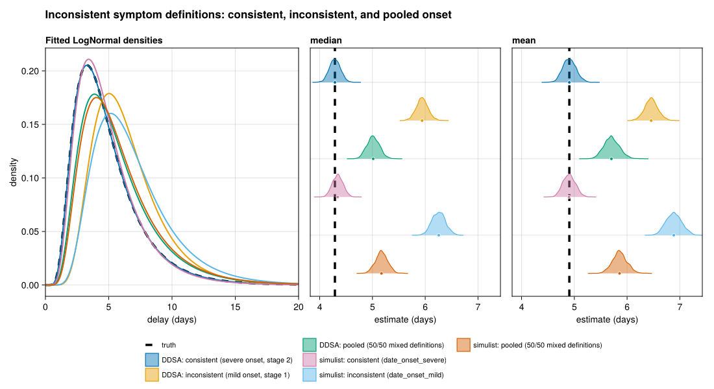

# Inconsistent symptom definitions (mild vs severe onset)
Sandra Montes (@slmontes)
2026-07-06

## The issue

The onset-to-admission delay remains well-defined only relative to a
fixed clinical definition of onset. Because disease progression
manifests as a sequence of symptoms, different surveillance systems or
clinical teams frequently anchor the onset date to different clinical
milestones, such as the initial mild symptom in one setting versus the
first severe or case-defining symptom in another. Calculating the delay
from an earlier symptom than the analysis intends to artificially
extends the interval by the duration of the mild-to-severe phase. This
represents a definitional shift rather than a measurement error or an
inherent uncertainty. Unlike the imputation and uncertain-date
scenarios, this structural bias cannot be resolved through statistical
date handling or censoring methods. The primary resolution requires
implementing a consistent clinical definition at the point of data
collection.

This issue can be exacerbated when a line list aggregates records from
clinical teams employing different definitions. In such cases, the
recorded delays form a mixture of two shifted distributions, a dynamic
that skews the central tendency and artificially increases the variance.
This same mechanism accounts for the closely related vagueness of
symptom onset row detailed in Table 1 of the manuscript. When the term
onset can refer to any of several symptoms emerging at different times,
the choice of which symptom to record functions identically to a formal
change in definition. Here, the analysis contrasts three clinical
anchors: a consistent definition based on severe onset (the metric used
to generate the baseline data), an inconsistent definition based on the
earlier mild onset, and a pooled line list that aggregates the two
definitions in equal proportions.

## Methods

Each simulated case carries two onset dates, an earlier mild-symptom
onset (`date_onset_mild`) and a later severe, case-defining onset
(`date_onset_severe`), together with an admission date. We then compute
the onset-to-admission delay under three choices of which onset the
analysis treats as the start of illness:

- **Consistent definition:** delay =
  `date_admission − date_onset_severe`.
- **Inconsistent definition:** delay =
  `date_admission − date_onset_mild` (the earlier onset).
- **Pooled definition:** each case independently uses severe or mild
  onset (50/50), modelling a line list that pools records from teams
  applying different definitions. This demonstrates the “complicates
  pooling” failure mode, where an intermediate, biased central estimate
  with inflated dispersion (a mixture of the two delay distributions) is
  obtained.

In the `simulist` pipeline the mild onset is already present in the
baseline line list: the R script samples
`date_onset_mild = date_onset_severe − Poisson(2)`, so no post-hoc shift
is applied in Julia.

In the DDSA pipeline the two onsets arise mechanistically: each case
progresses through a mild stage and then a severe stage
(`simulate_linelist_phase_mild_severe`, a GLCT phase-type 2-stage
chain). The gap between the mild and severe onsets, conditional on
progressing, is `1 + Geometric(p_k)` with `p_k = 2·p(γ)`. At
`P_PROGRESSION = 1.0` every case eventually reaches the severe stage,
and the chain reduces to the linear 2-stage Boxcar; lowering it leaves a
mild-only sub-cohort with no severe onset and no admission.

> [!NOTE]
>
> ### Calibration caveat
>
> The two pipelines do not impose exactly the same mild-to-severe gap,
> so their inconsistent-definition curves sit at slightly different
> distances from the truth. This is an artifact of how the two
> generators are calibrated, however both show the same qualitative
> bias, and its size is set by the definition gap a real line list would
> have, not by the method.

Inference uses `fit_lognormal_pcd`, a lognormal delay fit by Hamiltonian
Monte Carlo (`Turing.jl`) under a primary-event–censored likelihood from
`CensoredDistributions.jl` (Abbott et al. 2025), the Julia counterpart
of R’s `primarycensored` (Charniga 2024; Abbott et al. 2026). Here
`pwindow = 1` everywhere: there is no date uncertainty to integrate
over, because the bias is a definitional shift rather than an interval,
so the censoring machinery that repairs the earlier scenarios has
nothing to correct in this one. Running the two independently built
pipelines (DDSA in Julia, `simulist` in R) is again a cross-check that
the inflation is a property of the definition mismatch rather than of
one generator.

## Setup

``` julia
using Pkg
Pkg.instantiate()

using DDSALineLists
using DataFrames
using Dates
using Distributions
using Random

include(joinpath(@__DIR__, "..", "shared", "fit_helpers.jl"))
include(joinpath(@__DIR__, "..", "shared", "scenario_plots.jl"))
include(joinpath(@__DIR__, "..", "shared", "simulist_loader.jl"))

const SEED = 1234
const N_SUB = 500           # realistic surveillance sample size (primary fit cohort)
const P_PROGRESSION = 1.0   # 1.0 = linear Boxcar; <1.0 introduces a mild-only cohort
const FIG_DIR = abspath(joinpath(@__DIR__, "..", "..", "figures"))
const OUT_PATH = joinpath(FIG_DIR, "issue_symptom_definition.png")
```

## Helpers

``` julia
function delays_between(ll::AbstractDataFrame, onset_col::Symbol)
    delays = Float64[]
    on = ll[!, onset_col]
    adm = ll[!, :date_admission]
    for i in axes(ll, 1)
        (ismissing(on[i]) || ismissing(adm[i])) && continue
        d = Dates.value(adm[i] - on[i])
        d >= 0 || continue
        push!(delays, d)
    end
    return delays
end

function fit_pcd(delays; seed)
    fit_lognormal_pcd(delays;
        pwindow = ones(length(delays)),
        D = (length(delays) > 0 ? maximum(delays) : 0.0) + 2.0,
        n_samples = 1000, n_chains = 2, seed = seed)
end

# Pooled cohort: different teams or datasets apply different onset definitions.
# Each case independently uses severe onset with probability p_severe, otherwise
# mild onset — a line list that silently mixes the two definitions. delay =
# admission − chosen onset. The result is a mixture of the two shifted delay
# distributions: an intermediate, biased central estimate with inflated
# dispersion (the "complicates pooling" failure mode).
function pooled_delays(ll::AbstractDataFrame, mild_col::Symbol, severe_col::Symbol;
                       p_severe::Float64, seed::Int)
    rng = MersenneTwister(seed)
    mild = ll[!, mild_col]
    sev = ll[!, severe_col]
    adm = ll[!, :date_admission]
    delays = Float64[]
    for i in axes(ll, 1)
        ismissing(adm[i]) && continue
        on = rand(rng) < p_severe ? sev[i] : mild[i]
        ismissing(on) && continue
        d = Dates.value(adm[i] - on)
        d >= 0 || continue
        push!(delays, d)
    end
    return delays
end
```

## DDSA branch (GLCT phase-type 2-stage chain)

Setting `γ = 0.4` keeps each progression stage short, so the simulated
onset-to-admission delay stays on a scale comparable to
`LogNormal(1.5, 0.5)`. With `P_PROGRESSION = 1.0` every case reaches the
severe stage; lowering it leaves a mild-only sub-cohort with no severe
onset and no admission.

``` julia
p = DDSAParams(β = 0.6, γ = 0.4, ρ = 0.005, N = 30_000, nsteps = 200)
ll_ddsa = simulate_linelist_phase_mild_severe(p;
    p_progression = P_PROGRESSION,
    admi_delay_dist = LogNormal(1.5, 0.5),
    seed = SEED,
)
ll_ddsa = subsample_linelist(ll_ddsa, N_SUB; seed = SEED)
n_progressed_d = count(.!ismissing.(ll_ddsa.date_onset_severe))
println("DDSA staged line list: $(nrow(ll_ddsa)) cases, $n_progressed_d progressed to severe")

ddsa_severe = delays_between(ll_ddsa, :date_onset_severe)
ddsa_mild   = delays_between(ll_ddsa, :date_onset_mild)
ddsa_pooled = pooled_delays(ll_ddsa, :date_onset_mild, :date_onset_severe;
                            p_severe = 0.5, seed = SEED + 10)
est_ddsa_severe = fit_pcd(ddsa_severe; seed = SEED)
est_ddsa_mild   = fit_pcd(ddsa_mild;   seed = SEED + 1)
est_ddsa_pooled = fit_pcd(ddsa_pooled; seed = SEED + 10)

estimates = [est_ddsa_severe, est_ddsa_mild, est_ddsa_pooled]
labels = ["DDSA: consistent (severe onset, stage 2)",
          "DDSA: inconsistent (mild onset, stage 1)",
          "DDSA: pooled (50/50 mixed definitions)"]
```

## simulist branch (aligned baseline columns)

``` julia
ll_sim = load_simulist_baseline(seed = SEED)
if !isnothing(ll_sim)
    sym_admi = .!ll_sim.asymptomatic .& .!ismissing.(ll_sim.date_admission)
    sub = subsample_linelist(ll_sim[sym_admi, :], N_SUB; seed = SEED)
    println("simulist symptomatic admitted: $(nrow(sub)) cases")

    sim_severe = delays_between(sub, :date_onset_severe)
    sim_mild   = delays_between(sub, :date_onset_mild)
    sim_pooled = pooled_delays(sub, :date_onset_mild, :date_onset_severe;
                               p_severe = 0.5, seed = SEED + 12)
    push!(estimates, fit_pcd(sim_severe; seed = SEED + 2))
    push!(estimates, fit_pcd(sim_mild;   seed = SEED + 3))
    push!(estimates, fit_pcd(sim_pooled; seed = SEED + 12))
    push!(labels, "simulist: consistent (date_onset_severe)")
    push!(labels, "simulist: inconsistent (date_onset_mild)")
    push!(labels, "simulist: pooled (50/50 mixed definitions)")
else
    @warn "Skipping simulist branch — DDSA-only figure"
end
```

## Figure

Truth is the consistent-definition (severe onset) fit on undegraded
data.

``` julia
fig = comparison_figure(
    estimates, labels;
    truth = (meanlog = est_ddsa_severe.dist.μ, sdlog = est_ddsa_severe.dist.σ),
    title = "Inconsistent symptom definitions: consistent, inconsistent, and pooled onset",
)
save(OUT_PATH, fig)
fig
```



## Results

Anchoring the delay on severe onset, the definition used to generate the
data, recovers the clean-data reference: a median of about 4.29 days in
DDSA and 4.34 in `simulist`. Substituting the earlier mild onset
inflates the median to about 5.94 days in DDSA and 6.26 in `simulist`,
an overestimate of roughly 40% with no overlap between the two
definitions’ credible intervals. The size of this inflation tracks the
mild-to-severe interval, which is a property of the disease rather than
of the analysis: a wider gap between the two symptom milestones would
inflate the delay further.

Pooling a 50/50 mix of the two definitions, as happens when datasets or
teams applying different criteria are combined, produces an intermediate
but still biased median (about 5.02 days in DDSA, 5.17 in `simulist`)
and a larger standard deviation than under either single definition
(about 3.09 versus 2.72 in DDSA). This inflated spread is the signature
of pooling inconsistent definitions. The delays are a mixture of two
shifted distributions, so the variance absorbs the gap between the two
definition means on top of each definition’s own dispersion. None of the
three columns is recoverable after the fact, because the error is a
shift in what “onset” means rather than missing or uncertain
information. The remedy is a single, explicit onset definition applied
consistently at collection, or at least a flag recording which
definition each record used.

## Estimates

    ┌ Info: DDSA: consistent (severe onset, stage 2)
    │   n = 500
    │   median = (4.288551871476503, 4.0915424426910825, 4.493250735926015)
    │   mean = (4.905319627863075, 4.676931800010813, 5.165765565403016)
    └   sd = (2.7245801444790514, 2.464871780860387, 3.021177568766752)
    ┌ Info: DDSA: inconsistent (mild onset, stage 1)
    │   n = 500
    │   median = (5.940746489969326, 5.723893966206184, 6.168520787911174)
    │   mean = (6.4567869278263625, 6.213314905699762, 6.715584376776864)
    └   sd = (2.7478639122156823, 2.525482648269106, 3.0241536084046454)
    ┌ Info: DDSA: pooled (50/50 mixed definitions)
    │   n = 500
    │   median = (5.013908855955018, 4.794283164958679, 5.251024683984876)
    │   mean = (5.703080973711887, 5.440888986598865, 6.009924917757569)
    └   sd = (3.098692160256194, 2.79121062379936, 3.4697512683504472)
    ┌ Info: simulist: consistent (date_onset_severe)
    │   n = 500
    │   median = (4.342158317766912, 4.148943384049939, 4.536946842744401)
    │   mean = (4.899806224636079, 4.681707411443766, 5.133810938935199)
    └   sd = (2.5662685648098247, 2.330619166180114, 2.841815004818032)
    ┌ Info: simulist: inconsistent (date_onset_mild)
    │   n = 500
    │   median = (6.256060337657827, 6.016491316995573, 6.504871078875189)
    │   mean = (6.885150267372407, 6.617604231972806, 7.17922833347427)
    └   sd = (3.1697782790703526, 2.9012584775565835, 3.499652118309974)
    ┌ Info: simulist: pooled (50/50 mixed definitions)
    │   n = 500
    │   median = (5.171350841519244, 4.95086032962797, 5.397138606979933)
    │   mean = (5.857624218637, 5.5937436394865605, 6.138243747330913)
    └   sd = (3.1148955587162748, 2.8201979407102553, 3.4480790990464083)

<div id="refs" class="references csl-bib-body hanging-indent"
entry-spacing="0">

<div id="ref-CensoredDistributions_jl" class="csl-entry">

Abbott, Sam, Damon Bayer, Sam Brand, Michael DeWitt, and Joseph
Lemaitre. 2025. “CensoredDistributions.jl.”
<https://doi.org/10.5281/zenodo.18474652>.

</div>

<div id="ref-primarycensored" class="csl-entry">

Abbott, Sam, Sam Brand, James Mba Azam, Carl Pearson, Sebastian Funk,
and Kelly Charniga. 2026. *Primarycensored: Primary Event Censored
Distributions*. <https://doi.org/10.5281/zenodo.13632839>.

</div>

<div id="ref-charniga2024delays" class="csl-entry">

Charniga, Sang Woo AND Akhmetzhanov, Kelly AND Park. 2024. “Best
Practices for Estimating and Reporting Epidemiological Delay
Distributions of Infectious Diseases.” *PLOS Computational Biology* 20
(10): 1–21. <https://doi.org/10.1371/journal.pcbi.1012520>.

</div>

</div>
