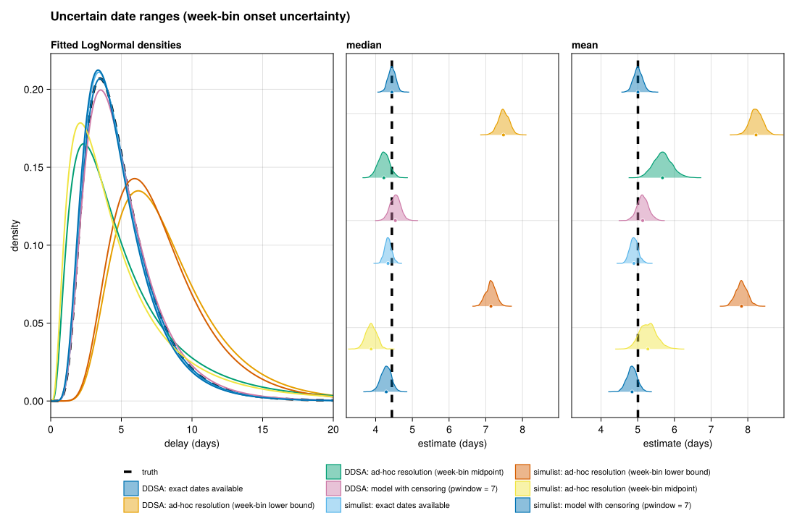

# Uncertain date ranges (week-bin onset uncertainty)
Sandra Montes (@slmontes)
2026-07-06

## The issue

Onset dates are often known only approximately. When a patient reports
symptom onset approximately 1 or 2 weeks prior, they are providing a
valid temporal interval rather than an incorrect date. A rigorous line
list records this as an interval, represented in this scenario as a
seven-day window. This inherent uncertainty does not constitute a bias
in itself, as the true onset date genuinely falls within the specified
window. Rather, bias can be introduced later on through the
methodological choices an analyst makes when resolving that interval
into the single discrete value required by a naive delay model.

This scenario aims to isolate two distinct analytical consequences.
First, collapsing the interval to an incorrect single date introduces a
location bias. For instance, resolving every onset to the beginning of
its respective week systematically overestimates the resulting delays.
Second, collapsing the interval to any single date, even one that is
accurate on average, discards the underlying uncertainty. This approach
results in an inaccurately precise delay distribution, with credible
intervals that are narrower than what the raw data support. As a result,
the size of the resulting error is significantly influenced by the
analytical method selected. False precision arises when inherent
uncertainty is discarded rather than being accounted for in the
statistical fit.

By binning each onset onto a fixed weekly calendar grid, the scenario
can represent the temporal uncertainty rather than structural
measurement error. A fixed grid, rather than one anchored to the report
date, leaves the true onset uniformly distributed within its week. This
binning procedure is applied across both pipelines to evaluate four
distinct methodological approaches for handling interval data.

## Methods

We evaluate four approaches to resolving the seven-day onset window:

- **Exact dates available:** the delay is computed from the true
  `date_onset` with `pwindow = 1`, providing the clean-data reference.
- **Ad-hoc resolution (lower bound):** each onset is binned into the
  fixed seven-day calendar week containing it and then resolved to the
  lower bound of that window, again with `pwindow = 1`. Because the bin
  always contains the true onset, the lower bound places onset as early
  as possible and therefore inflates the delay the most, making this the
  worst-case resolution.
- **Ad-hoc resolution (midpoint):** the same bins are used, but each
  onset is resolved to the bin midpoint, again with `pwindow = 1`. This
  is the common pragmatic choice: it is roughly centred on average, but
  because it still commits to a single date it inflates the dispersion,
  adding a spurious within-week spread on top of the true delay
  variation.
- **Model with censoring:** the same bins are used, but rather than
  resolving to a single date the censored fit takes the full bin width
  (`pwindow = 7`).

Presenting both the lower-bound and midpoint resolutions makes clear
that the magnitude of the bias is largely an analytical choice, with the
lower bound representing the worst case, whereas the censoring approach
provides the principled correction.

The lower-bound and midpoint resolutions both set `pwindow = 1`,
instructing the fit to treat the resolved date as exact. The censoring
approach instead sets `pwindow = 7`, which places a uniform prior over
where within the week the true onset fell and allows the likelihood to
integrate across that window rather than committing to a single point.
This is the mechanism by which the date uncertainty is propagated into
the credible intervals (Charniga 2024). Because the onset is binned onto
a fixed calendar grid, the true onset is uniformly distributed within
its week, so this uniform primary-event prior is correctly specified.
The week-binning is performed by the helper
`add_calendar_week_uncertainty!`, which assigns each true onset to the
calendar week (Monday–Sunday) containing it and writes
`date_onset_lower` and `date_onset_upper`. The two `week_bin_delays`
resolutions are the analyst’s choices layered on that recorded interval.

Inference throughout uses `fit_lognormal_pcd`, a lognormal delay fit by
Hamiltonian Monte Carlo (`Turing.jl`) under a primary-event–censored
likelihood from `CensoredDistributions.jl` (Abbott et al. 2025), the
Julia counterpart of R’s `primarycensored` (Abbott et al. 2026). As in
the other scenarios we run two independently built line lists: the DDSA
mechanistic model (Julia) and a `simulist` clean line list (R) degraded
by the identical week-binning rule. Agreement between them is a
cross-check that the bias is a property of the uncertainty handling
rather than of one generator.

## Setup

``` julia
using Pkg
Pkg.instantiate()

using DDSALineLists
using DataFrames
using Dates
using Distributions
using Random

include(joinpath(@__DIR__, "..", "shared", "fit_helpers.jl"))
include(joinpath(@__DIR__, "..", "shared", "scenario_plots.jl"))
include(joinpath(@__DIR__, "..", "shared", "simulist_loader.jl"))

const SEED = 1234
const N_SUB = 500   # realistic surveillance sample size (primary fit cohort)
const FIG_DIR = abspath(joinpath(@__DIR__, "..", "..", "figures"))
const OUT_PATH = joinpath(FIG_DIR, "issue_uncertain_dates.png")
```

## Helpers

``` julia
# Truth: pwindow = 1, delays from true onset.
function exact_delays(ll::AbstractDataFrame)
    delays = Float64[]
    for i in axes(ll, 1)
        on = ll.date_onset[i]
        adm = ll.date_admission[i]
        (ismissing(on) || ismissing(adm)) && continue
        d = Dates.value(adm - on)
        d >= 0 || continue
        push!(delays, d)
    end
    return delays
end

# Build (delay, pwindow) from the week-bin interval written by
# `add_calendar_week_uncertainty!`, under three analyst choices:
#   :lower    — resolve onset to the bin's LOWER bound, pwindow = 1. The worst
#               case: because the bin always contains the true onset, the lower
#               bound pushes onset earliest and inflates the delay most.
#   :midpoint — resolve onset to the bin MIDPOINT, pwindow = 1. The common
#               pragmatic choice; roughly unbiased in the delay center but still
#               treats a single date as exact (under-disperses).
#   :censor   — keep the whole bin: delay from the lower bound, pwindow = bin
#               width, so the censored fit integrates over the uncertainty.
function week_bin_delays(ll::AbstractDataFrame; mode::Symbol)
    delays = Float64[]
    pwindows = Float64[]
    for i in axes(ll, 1)
        lo = ll.date_onset_lower[i]
        hi = ll.date_onset_upper[i]
        adm = ll.date_admission[i]
        (ismissing(lo) || ismissing(hi) || ismissing(adm)) && continue
        width = Dates.value(hi - lo)
        ref, pw = if mode === :censor
            lo, Float64(width + 1)
        elseif mode === :midpoint
            lo + Day(width ÷ 2), 1.0
        else  # :lower
            lo, 1.0
        end
        d = Dates.value(adm - ref)
        d >= 0 || continue
        push!(delays, d)
        push!(pwindows, pw)
    end
    return delays, pwindows
end

function fit_pcd(delays; pwindow = ones(length(delays)), seed::Int)
    fit_lognormal_pcd(delays;
        pwindow = pwindow,
        D = (length(delays) > 0 ? maximum(delays) : 0.0) + 2.0,
        n_samples = 1000, n_chains = 2, seed = seed)
end
```

## DDSA branch

``` julia
p = DDSAParams(β = 0.6, γ = 0.4, ρ = 0.005, N = 30_000, nsteps = 200)
ll_ddsa = simulate_linelist_ddsa(p;
    reporting_delay_dist = Distributions.Gamma(3, 1),
    admi_delay_dist = LogNormal(1.5, 0.5),
    seed = SEED,
)
ll_ddsa = subsample_linelist(ll_ddsa, N_SUB; seed = SEED)
add_calendar_week_uncertainty!(ll_ddsa)  # fixed weekly grid: onset uniform within its week

ddsa_exact = exact_delays(ll_ddsa)
ddsa_lower, ddsa_lower_pw = week_bin_delays(ll_ddsa; mode = :lower)
ddsa_mid,   ddsa_mid_pw   = week_bin_delays(ll_ddsa; mode = :midpoint)
ddsa_model, ddsa_model_pw = week_bin_delays(ll_ddsa; mode = :censor)

est_ddsa_exact = fit_pcd(ddsa_exact;                            seed = SEED)
est_ddsa_lower = fit_pcd(ddsa_lower; pwindow = ddsa_lower_pw,   seed = SEED + 1)
est_ddsa_mid   = fit_pcd(ddsa_mid;   pwindow = ddsa_mid_pw,     seed = SEED + 3)
est_ddsa_model = fit_pcd(ddsa_model; pwindow = ddsa_model_pw,   seed = SEED + 2)

estimates = [est_ddsa_exact, est_ddsa_lower, est_ddsa_mid, est_ddsa_model]
labels = ["DDSA: exact dates available",
          "DDSA: ad-hoc resolution (week-bin lower bound)",
          "DDSA: ad-hoc resolution (week-bin midpoint)",
          "DDSA: model with censoring (pwindow = 7)"]
```

## simulist branch

The `simulist` baseline is cached as
`analyses/shared/simulist_baseline_seed<N>.csv`. If R or `simulist` is
unavailable the branch is skipped and a DDSA-only figure is produced.

``` julia
ll_sim = load_simulist_baseline(seed = SEED)
if !isnothing(ll_sim)
    have = .!ll_sim.asymptomatic .& .!ismissing.(ll_sim.date_admission) .&
           .!ismissing.(ll_sim.date_onset) .& .!ismissing.(ll_sim.date_reporting)
    sub = ll_sim[have, :]
    sub = subsample_linelist(sub, N_SUB; seed = SEED)
    add_calendar_week_uncertainty!(sub)  # same observation process as the DDSA branch
    println("simulist symptomatic admitted with onset+reporting: $(nrow(sub)) cases")

    sim_exact = exact_delays(sub)
    sim_lower, sim_lower_pw = week_bin_delays(sub; mode = :lower)
    sim_mid,   sim_mid_pw   = week_bin_delays(sub; mode = :midpoint)
    sim_model, sim_model_pw = week_bin_delays(sub; mode = :censor)

    push!(estimates, fit_pcd(sim_exact;                         seed = SEED + 10))
    push!(estimates, fit_pcd(sim_lower; pwindow = sim_lower_pw, seed = SEED + 11))
    push!(estimates, fit_pcd(sim_mid;   pwindow = sim_mid_pw,   seed = SEED + 13))
    push!(estimates, fit_pcd(sim_model; pwindow = sim_model_pw, seed = SEED + 12))
    push!(labels, "simulist: exact dates available")
    push!(labels, "simulist: ad-hoc resolution (week-bin lower bound)")
    push!(labels, "simulist: ad-hoc resolution (week-bin midpoint)")
    push!(labels, "simulist: model with censoring (pwindow = 7)")
else
    @warn "Skipping simulist branch — DDSA-only figure"
end
```

## Figure

The reference is the exact-dates fit on undegraded DDSA data.

``` julia
fig = comparison_figure(
    estimates, labels;
    truth = (meanlog = est_ddsa_exact.dist.μ, sdlog = est_ddsa_exact.dist.σ),
    title = "Uncertain date ranges (week-bin onset uncertainty)",
)
save(OUT_PATH, fig)
fig
```



## Results

Compared to a clean-data reference with a median of 4.44 days, the
handling choices span nearly the entire range of possible errors.
Resolving each week to its earliest day places every onset about three
days too early, since on a fixed calendar grid the true onset falls
roughly uniformly across the seven days, and overestimates the median
delay to about 7.48 days in DDSA and 7.14 in `simulist`. Resolving to
the week midpoint instead brings the median back close to the reference
(about 4.22 days in DDSA and 3.88 in `simulist`), because the midpoint
sits near the average true onset within the week.

The two point resolutions differ once the dispersion is considered.
Committing each onset to a single date discards the within-week
uncertainty, and the midpoint resolution nearly doubles the fitted
standard deviation (about 5.09 days in DDSA and 4.85 in `simulist`,
against a clean-data 2.60), so its credible intervals are falsely
precise. Treating the whole week as interval-censored is the only
approach that recovers both quantities, returning the median to the
reference (about 4.54 days in DDSA, 4.29 in `simulist`) and the standard
deviation to near its true value (about 2.73 days in DDSA, 2.55 in
`simulist`) while propagating the date uncertainty into wider, honest
credible intervals. Because a fixed calendar grid leaves the true onset
uniformly distributed within its week, the uniform primary-event prior
of the censored fit is correctly specified, so the censored estimate is
unbiased in both location and spread rather than merely honest about its
uncertainty (Charniga 2024).

In sum, the analyst largely determines the magnitude of error, which
ranges from severe under a careless lower-bound resolution, through the
false precision of a midpoint that discards the interval, to negligible
under censoring that propagates it.

## Estimates

    ┌ Info: DDSA: exact dates available
    │   n = 500
    │   median = (4.442017797100446, 4.246014028033202, 4.636091205372196)
    │   mean = (5.006874883465136, 4.781662723798852, 5.250721320881024)
    └   sd = (2.6014689918029585, 2.356052158960175, 2.8883595025413475)
    ┌ Info: DDSA: ad-hoc resolution (week-bin lower bound)
    │   n = 500
    │   median = (7.482115675082779, 7.185779913545726, 7.774668109537469)
    │   mean = (8.225373513433803, 7.900462845677497, 8.574095606498398)
    └   sd = (3.753330393378786, 3.4382571300630027, 4.117048353817489)
    ┌ Info: DDSA: ad-hoc resolution (week-bin midpoint)
    │   n = 491
    │   median = (4.223025807278056, 3.9232247125230244, 4.533574150140943)
    │   mean = (5.676203131872411, 5.220026300775284, 6.19815113375221)
    └   sd = (5.08720658298868, 4.364825196203092, 6.059548482649521)
    ┌ Info: DDSA: model with censoring (pwindow = 7)
    │   n = 500
    │   median = (4.536847583598517, 4.262499097293831, 4.804161555491905)
    │   mean = (5.135553774872746, 4.834372204608841, 5.457774997593322)
    └   sd = (2.730771255551976, 2.4072037688005232, 3.1313541814503623)
    ┌ Info: simulist: exact dates available
    │   n = 500
    │   median = (4.336928858408264, 4.159397790115631, 4.537212956532551)
    │   mean = (4.8972705021548055, 4.691845815904351, 5.137942693955153)
    └   sd = (2.563261960617906, 2.3250074353672665, 2.8457462987237143)
    ┌ Info: simulist: ad-hoc resolution (week-bin lower bound)
    │   n = 500
    │   median = (7.140786346696306, 6.874768535612562, 7.402708989784726)
    │   mean = (7.829436860305815, 7.531886140751759, 8.152385918306441)
    └   sd = (3.5243584536496186, 3.2324533037864867, 3.8423398437808447)
    ┌ Info: simulist: ad-hoc resolution (week-bin midpoint)
    │   n = 491
    │   median = (3.8778185297458565, 3.59845146018145, 4.150879035473521)
    │   mean = (5.2777543916445, 4.867112407075739, 5.778171274867044)
    └   sd = (4.845083578286294, 4.184515940048259, 5.833895911896906)
    ┌ Info: simulist: model with censoring (pwindow = 7)
    │   n = 500
    │   median = (4.288424578289564, 3.9931837262415804, 4.555284785956525)
    │   mean = (4.847128120538818, 4.565175508304908, 5.117986802248733)
    └   sd = (2.5497608639350453, 2.2085597227595564, 2.947166536094003)

<div id="refs" class="references csl-bib-body hanging-indent"
entry-spacing="0">

<div id="ref-CensoredDistributions_jl" class="csl-entry">

Abbott, Sam, Damon Bayer, Sam Brand, Michael DeWitt, and Joseph
Lemaitre. 2025. “CensoredDistributions.jl.”
<https://doi.org/10.5281/zenodo.18474652>.

</div>

<div id="ref-primarycensored" class="csl-entry">

Abbott, Sam, Sam Brand, James Mba Azam, Carl Pearson, Sebastian Funk,
and Kelly Charniga. 2026. *Primarycensored: Primary Event Censored
Distributions*. <https://doi.org/10.5281/zenodo.13632839>.

</div>

<div id="ref-charniga2024delays" class="csl-entry">

Charniga, Sang Woo AND Akhmetzhanov, Kelly AND Park. 2024. “Best
Practices for Estimating and Reporting Epidemiological Delay
Distributions of Infectious Diseases.” *PLOS Computational Biology* 20
(10): 1–21. <https://doi.org/10.1371/journal.pcbi.1012520>.

</div>

</div>
